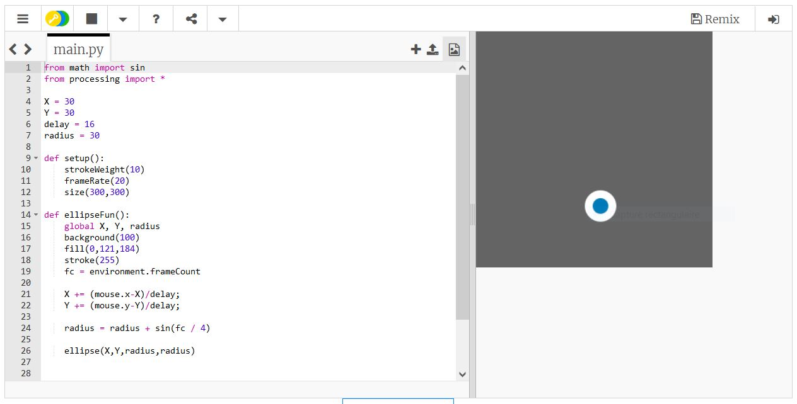

# IDE

Comme pour tous les langages de programmation, il n'existe pas **un** logiciel permettant de coder en Python, mais un très (très) grand nombre de logiciels différents, qu'on regroupe sous le nom d'IDE (interfaces de développement)

Pour la NSI, nous conseillons ... :

## Installer ...
<!---
{: .center}
-->

1. ...

2. ...

## Alternatives

Pyzo, PyCharm, Spyder, Thonny, VisualStudioCode... impossible de toutes les citer !

## Solutions en ligne
En ligne, sans aucune installation, vous pouvez utiliser [https://console.basthon.fr/](https://console.basthon.fr/){:target="_blank"}

ou encore
[https://trinket.io/python){:target="_blank"}

ou bien même la console ci-dessous !

{{ terminal() }}

ou l'IDE qui suit :

{{ IDEv() }}