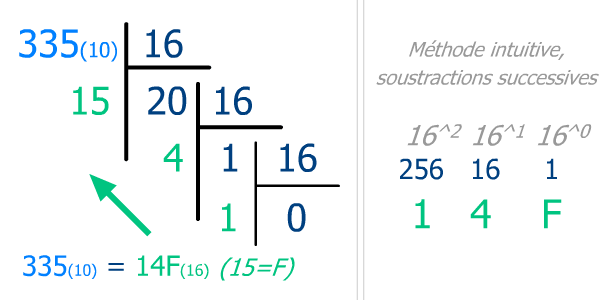

# 2.4 Représentation d'un entier positif dans différentes bases

{: .center}


{: .center}


Hormis la base 10, deux bases sont utilisées en informatique :

- la base 2  (le système **binaire**)
- la base 16 (le système **hexadécimal**)

Dans toute la suite, la base dans laquelle le nombre est écrit sera précisée en indice.  
Exemple : $13_{10}=1101_2=\rm{D}_{16}$

## 1. Le système binaire 

En base 2, on ne dispose que des chiffres `0` et `1`. Le système binaire est un système de numération de position (comme le système décimal, hexadécimal... mais pas comme le système romain). À chaque rang correspond une puissance de 2.

### 1.1 Du binaire vers le décimal :


|...|128|64|32|16|8|4|2|1|
|:---:|:---:|:---:|:---:|:---:|:---:|:---:|:---:|:---:|
|...|$2^7$|$2^6$|$2^5$|$2^4$|$2^3$|$2^2$|$2^1$|$2^0$|
|...|1|1|0|1|0|0|1|0|


 $11010010_2=1 \times 2^7+ 1 \times 2^6+0 \times 2^5+1 \times 2^4+0 \times 2^3+0 \times 2^2+1 \times 2^1+0 \times 2^0=128+64+32+2=210_{10}$
 
 Le nombre binaire 11010010 correspond donc au nombre décimal 210.
 

!!! note "Code Python"
    En Python, on peut utiliser la fonction `int("nombre", base)`.
    ```python
    >>> int("11010010", 2)
    210
    ```


### 1.2 Du décimal vers le binaire : 
Principe : dans chaque nombre décimal, il existe une plus grande puissance de 2 qui est inférieure au nombre. 

Par exemple, dans 243, il y a 128. Donc   
$243=128 + (115)$   
$243=128+64+(51)$     
$243=128+64+32+(19)$    
$243=128+64+32+16+(3)$   
$243=128+64+32+16+2+1$  
$243=1 \times 2^7+ 1 \times 2^6+1 \times 2^5+1 \times 2^4+0 \times 2^3+0 \times 2^2+1 \times 2^1+1 \times 2^0$

Donc $243_{10}=11110011_2$

**Méthode des divisions successives**

{: .center}

!!! note "Code Python"
    En Python, on peut utiliser la fonction `bin(nombre)`. Elle renvoie une chaîne de caractère où le nombre binaire est précédé de `'0b'`.
    ```python
    >>> bin(243)
    '0b11110011'
    ```

!!! example "Exercice 1"
    === "Énoncé"
        Quelle est la valeur maximale d'un octet (un octet = 8 chiffres binaires) ?


!!! example "Exercice 2"
    === "Énoncé"
        Créer une fonction `binaire(n)` qui renvoie l'écriture binaire de `n`, en utilisant les divisions successives.


## 2. Le système hexadécimal 
L'inconvénient essentiel du système binaire est la longueur de l'écriture des nombres qu'il génère. Pour cette raison, le **système hexadécimal**, ou système de **base 16** est très souvent employé.

- Pour écrire en base 2, il faut 2 chiffres différents : le 0 et le 1.  

- Pour écrire en base 10, il faut 10 chiffres différents: 0,1,2,3,4,5,6,7,8,9.  

- Pour écrire en base 16, il faut donc 16 chiffres différents : **0,1,2,3,4,5,6,7,8,9,A,B,C,D,E,F**.    


On a donc la correspondance :

- A représente 10  
- B représente 11  
- C représente 12  
- D représente 13  
- E représente 14  
- F représente 15 

### 2.1 Convertir du binaire en Hexadécimal
Il suffit tout simplement de réunir les bits par quartet (4) pour créer la base 16.  
Attention à commencer par la droite !  

*Exemple à convertir :* 1001101011  

- En commençant par la gauche : 1001 1010 11??  
	Il manque 2 bits pour terminer...  
	
- En commençant par la droite : 0010 0110 1011  
	Pas assez de bits pour arriver à 4 ?  

Il suffit d'ajouter au besoin pour vous aider des 0 devant (ils sont non significatifs) !   
Ainsi, le quartet de droite, le poids le plus faible:  

1011 = 8 + 0 + 2 + 1 = 11 = B  
0110 = 0 + 4 + 2 + 0 = 6 = 6  
0010 = 0 + 0 + 2 + 0 = 2  

Soit en hexadécimal la valeur 26B ; quand même plus aisée à communiquer !  

### 2.2 Convertir de Hexadécimal vers binaire :

*Exemple avec 6C3F :*  

F = 15 = 1111  
3 = 0011  
C = 12 = 1100  
6 = 0110  

Soit 6C3F(16) = 0110 1100 0011 1111(2)  

### 2.3 Du décimal vers l'hexadécimal :

2 solution sont possibles :

- Passer par la base 2 : on convertit le nombre de la base 10 à la base 2 puis de la base 2 à la base 16 comme expliqué au 2.1.  

- Utiliser la méthode des divisions succesives par 16.  

{: .center}


### 2.4 De l'hexadécimal vers le décimal :

|256|16|1|
|:---:|:---:|:---:|
|$16^2$|$16^1$|$16^0$|
| 1| D|2|


 $\rm{1D2}_{16}=1 \times 16^2+ 13 \times 16^1+2 \times 16^0=256+208+2=466_{10}$
 
 Le nombre hexadécimal `1D2` correspond donc au nombre décimal 466.
 
 
 En pratique, l'hexadécimal est surtout utilisé pour sa capacité à représenter la valeur de n'importe quel octet sur 2 chiffres ("chiffres" étant à prendre au sens large = chiffres ou lettres !).
 

!!! example "Exercice 3"
    === "Énoncé"
        1. Donner la valeur des octets `FF`, `3A`, `B2`.
        2. Expliquer pourquoi la couleur RGB (138,255,51) a pour code html `#8AFF33`.
        3. Quelle est la couleur `html` du blanc ?

###  2.2 En python :
 
#### 2.2.1 Pour passer du décimal à l'hexadécimal :  
On peut utiliser la fonction `hex(nombre)`. Elle renvoie une chaîne de caractère où le nombre hexadécimal est précédé de `'0x'`.


```python
>>> hex(125)
'0x7d'
```

#### 2.2.2 Pour passer de l'hexadécimal au décimal :  
On peut utiliser la fonction `int("nombre",base)`.

```python
>>> int("FF", 16)
 255
```


## 3. Du binaire inattend : Le message secret de Perseverance

Lors de sa descente vers la planète Mars le 18/02/2021, le rover Perseverance de la Nasa a freiné sa chute grâce à un parachute qui a intrigué quelques internautes du forum Reddit.

{: .center}

Vidéo du déploiement du parachute :

<p align="center">
<iframe width="790" height="444" src="https://www.youtube.com/embed/N3b-1-yrQYw" title="YouTube video player" frameborder="0" allow="accelerometer; autoplay; clipboard-write; encrypted-media; gyroscope; picture-in-picture" allowfullscreen></iframe>
</p>

Les zones blanches et rouge se décomposent comme ceci :

{: .center}


### Indications

- Le tout premier secteur contenant un message est le secteur sur lequel est écrite la lettre D, qui est effectivement la signification de ce secteur. C'est en l'observant bien que vous comprendrez le codage qui a été utilisé.
- Les autres secteurs sont marqués de points d'interrogation : c'est à vous de découvrir ce qu'ils cachent.
- La phrase mystère s'obtiendra en tournant en spirale depuis la lettre D, dans le sens horaire.
- La dernière couronne (la plus à l'extérieur) est un peu particulière, mais n'en disons pas plus...

### À vous !


Un grand bravo aux brillants _redditors_ ```u/rdtwt1``` et ```u/tend0g```.


### Update : faites votre propre parachute !
[https://sjwarner.github.io/perseverance-parachute-generator/?](https://sjwarner.github.io/perseverance-parachute-generator/?)


#### Sources (attention spoiler):
- https://www.lemonde.fr/pixels/article/2021/02/23/des-internautes-dechiffrent-un-message-cache-dans-le-parachute-du-rover-de-la-nasa-sur-mars_6070952_4408996.html
- https://www.reddit.com/r/nasa/comments/lpy2fa/does_the_parachute_for_perseverance_have_some/goedts0/
- https://twitter.com/steltzner/status/1364076615932645379

