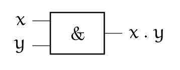
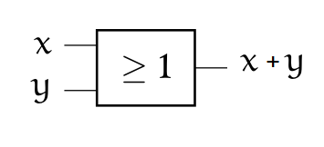
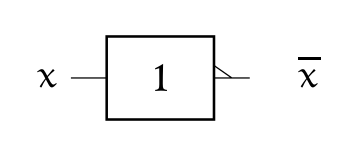
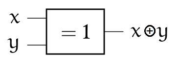
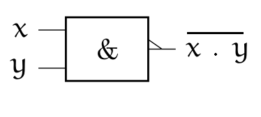
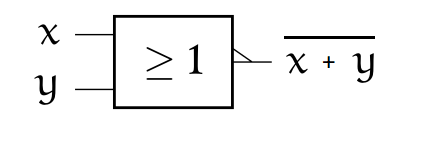
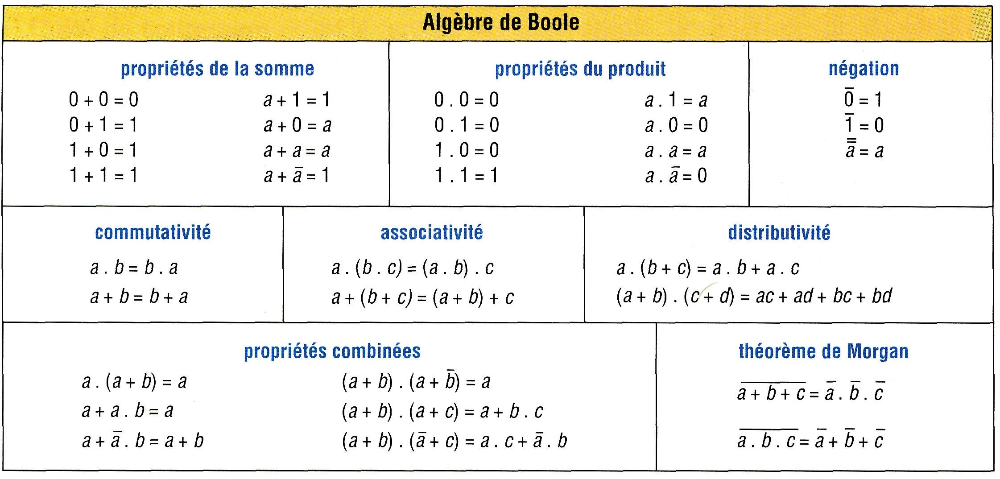

# Les opérateurs booléens

{: .center}


## 1. Repères historiques

{: .center}


En 1847, le  britannique  *George BOOLE*  inventa un formalisme permettant d'écrire des raisonnements logiques : l'algèbre de Boole. La notion même d'informatique n'existait pas à l'époque, même si les calculs étaient déjà automatisés (penser à la Pascaline de 1642).

Bien plus tard, en  1938, les travaux de l'américain *Claude  SHANNON*  prouva  que des  circuits  électriques
peuvent  résoudre tous  les  problèmes  que l'algèbre  de  Boole peut  elle-même résoudre.  Pendant la deuxième guerre mondiale, les travaux  d'*Alan  TURING*  puis de *John VON NEUMANN* poseront définitivement les bases de l'informatique moderne.

## 2. Algèbre de Boole

L'algèbre de Boole définit des opérations dans un ensemble
qui ne contient que **deux éléments** notés **0 et 1**, ou bien **FAUX et VRAI** ,ou encore **False** et **True** (en Python)

Les opérations fondamentales sont :

- la *conjonction* ("ET") 
- la *disjonction* ("OU") 
- la *négation* ("NON").

Dans  toute la  suite,  `x` et  `y` désigneront  des  *Booléens* (éléments  d'une
algèbre de Boole) quelconques, `F` désignera FAUX et `V` désignera VRAI.

____________

### 2.1 Conjonction (AND)
- français : ET
- anglais (et Python) : `and`
- notation logique : $\wedge$
- notation mathématique :  `.`
- autre symbole : & (appelé _esperluette_ en français et _ampersand_ en anglais)  

C'est l'opération définie par:

* `x and F = F`
* `x and V = x`

Puisque l'algèbre de  Boole ne contient que deux éléments,  on peut étudier tous
les cas possibles et les regrouper dans un tableau appelé **table de vérité**:

!!! abstract "Table de vérité de AND :heart:"
    |`x`| `y` | `x & y`|
    |:--:|:-:|:--:|
    |F|F|F|
    |F|V|F|
    |V|F|F|
    |V|V|V|

Notations usuelles:  

* $Q=A . B$  
* $Q=A \wedge B$  
* $Q=A$&$B$  
* $Q=A and B$  

On représente souvent les opérateurs booléens à l'aide de portes logiques:

Symbole européen (norme ISO): 
{: .center}
Symbole américain (norme ANSI):
{: .center}


#### Exemples en Python


```python
>>> n = 20
>>> (n % 10 == 0) and (n % 7 == 0)
False
>>> (n % 4 == 0) and (n % 5 == 0)
True
```

#### L'évaluation paresseuse
Pouvez-vous prévoir le résultat du code ci-dessous ?


```python
>>> (n % 4 == 0) and (n % 0 == 0)
    ---------------------------------------------------------------------------

    ZeroDivisionError                         Traceback (most recent call last)

    <ipython-input-3-d8a98dcba9be> in <module>
    ----> 1 (n % 4 == 0) and (n % 0 == 0)
    

    ZeroDivisionError: integer division or modulo by zero
```

Évidemment, la division par 0 provoque une erreur.  
Mais observez maintenant ce code :


```python
>>> (n % 7 == 0) and (n % 0 == 0)
False
```

On appelle **évaluation paresseuse** le fait que l'interpréteur Python s'arrête dès que sa décision est prise : comme le premier booléen vaut False et que la conjonction `and` est appelée, il n'est pas nécessaire d'évaluer le deuxième booléen. 


### 2.2 Disjonction (OR)

- français : OU
- anglais (et Python) : `or`
- notation logique : $\vee$
- notation mathématique :  $+$
- autre symbole : | appelé _pipe_ en anglais

C'est l'opération définie par:

* `x or V = V`
* `x or F = x`

On en déduit la table suivante:


!!! abstract "Table de vérité de OR :heart:"
    |`x`| `y` | `x or y`|
    |:--:|:----:|:--:|
    |F|F| F|
    |F|V|V|
    |V|F|V|
    |V|V|V|

Notations usuelles:  

* $Q=A + B$   
* $Q=A \vee B$  
* $Q=A or B$   
* $Q=A | B$  

Symbole européen (norme ISO):  
{: .center}
Symbole américain (norme ANSI):
{: .center}


#### Exemples en Python


```python
>>> n = 20
>>> (n % 10 == 0) or (n % 7 == 0)
True
>>> (n % 4 == 0) or (n % 5 == 0)
True
>>> (n % 7 == 0) or (n % 3 == 0)
False
```


#### L'évaluation paresseuse (retour)
Pouvez-vous prévoir le résultat du code ci-dessous ?


```python
>>> (n % 5 == 0) or (n % 0 == 0)
```

### 2.3  Négation (NOT)

- français : NON
- anglais (et Python) : `not`
- notation logique :  $\neg$
- notation mathématique :  $\overline{x}$
- autre symbole  : ~  

C'est l'opération définie par:

* `not V = F`
* `not F = V`

On en déduit la table suivante:

!!! abstract "Table de vérité de NOT :heart:"
    |`x`| `not x` |
    |:--:|:----:|
    |F|V|
    |V|F|

Notations usuelles:  

* $Q=\overline{A}$  
* $Q=\neg A$  
* $Q=not A$  
* $Q=$ ~$A$  

Symbole européen (norme ISO): 
{: .center}
Symbole américain (norme ANSI):
{: .center}

#### Exemples en Python


```python
>>> n = 20
>>> not(n % 10 == 0)
False
```


### 2.4 Exercice 1

*Exemple de circuit :*
{: .center}

1. Ouvrir le [simulateur de circuits](http://dept-info.labri.fr/ENSEIGNEMENT/archi/circuits/blank-teacher.html){. target="_blank"} et créer pour chaque opération AND, OR, NOT un circuit électrique illustrant ses propriétés.

2. Utiliser successivement les circuits XOR, NAND et NOR et établir pour chacun leur table de vérité.


Un [corrigé](https://dept-info.labri.fr/ENSEIGNEMENT/archi/circuits/blank-teacher.html#wpVXa2/DkzAUw73CjsOEf8KIw7IBwoHDlE3CscOjwqZuwoXCkMOGwrrCiQFrwqduwqBJCMKkwq5Nw5vCiCwewqkDwpvCgMO/wo7DsyjCjcKvwq/CncOtW3d8w47DjX0cP8O2w7vDuTPDj8OzfyVLwrnDsUfChAZBwq8CNnHCssOeSH/DhHfDgHYjfl0JwpHDnsKIe38kw7Miwq5hwrnCg8K+wpR/esOeb18+w5zDhcO+w4g/w4vDvMK/PcKATQtpwoLDo2MTw7t4MjbDgcKLYsK7wpnCrlbClgXDpHNXYsK9TmMTf8O7w6nDlAQnw5MrEzzCmiB5TFB0OsODYiLDoDUKwqLDlMOpJcOSwpvCuyTDi8Krw5lgK2nCvEIWw5gbwobCgMKvEXDCsMKNw5cmSiIUZjfCicOEBcK7wpXCt8OFw5ZcwpwJOcOPH07CssKFWMOGecOHMhpAwoHCmMK7FMKMGsOsc8KSw4tiwp4eYMKaw50aKsKcXR7CnCJOecO/AcKFwq9QdMKMwqJcw7XDp1gUwpnDhBrDsG7CnsKuwo7ClmhvTsKLNMK1LMKVLcK3LFEpw5g4wrbCtDvClMKCWxfCmRQkwrLCrsK2w6LConNSanrCkSfDgjrDqsOzw6IeBSnCisKiw5/CqHFEMMKOb8Kxw6gVwoxGOsOLFhgdARUTwo3CoMOIKMKuw4bCgsOiE8OLBsK5LG5Qw7zDpMKHwrIqHklIw7zDixnDvsOlGifDiMKJwoNPEjnDr8OGByfDiMKOwonDl8OIwqEywrMdBBXCjsOFOcOOw6TDgQTChVXCj8ORwpXCu8OCalPCtTbCicOvw6XDmR3CulQmMcOPwr7Do2vDosO2wrxIw5HCpcKjwrRAw7HDo1Qsw7BgCHjDsSlAUWQwwrPDqcK5w6LClsOgw5fDusOiXcOGP8KTRcK8NS/DnsOydsOqw7nDiVLDvVTCnEDDvVbCtzMdRj3Dv8OBHw1ow49Pw6c3cWrCu8Ocw5RtwrwXwpNaw4zCuMKhw4Uuw63DpsK6w53Di2ktJ1HCrWfDgV7Cj8OsTEMew6pyEsKwwr3DvsKhI3PCpmVOA8O+w4TDlMO7w6DDm8KcPS3Dt0jDl8OTdsOtSMOuw6rDssOfawfDusOIKMKJw7Zaw6zClcKgFcOOa3HCv8OWwoZhw6Quwrx8w7XDrMOFQ8O9w4vCmhp9Hxl1wpNAL1wLwoE0wq58w6jCtcOUO8ODwpXDrcKCw6pMSA/CiXDCrcO1wo5Qwr0Ew4ZawpNHX17CusOhQ8KtfVF7bMKPw7INYcOAw7PDhF3CvxkAOMKPccK3c0ADI8K9woFaw7nDt8OeN8Kvw4t7wqQxHwt4w5MBw642wp9ZQMOjQDJoTsKcw7YMwpHDj8KbAcKGesKAw77DgMOdQsOdw4J0d8OgNVs/CmnCh8KHwoHCngA9w6cdesONQMKUagZiXQbDkg9rw5rDmMKvw7J9WcK6dsOseMOzbMOpwpXCuwDDqSLCiMODw7Q4A8OKw4E+wqpidcOawok2ZsOswpdHL3RDKx9Pw6TDnlPDgsO+d2lzSMOQdsOUF1gAMMKkw4bCpSHCr8OzUsO/wrZ2DAkkw4DDtQQ0fVnDiEvCr8OKw6NVZ8KgIQg0w5RKw7nDk11KGMOowqXDkMKIPcKpwpTCkMOoGWjDul0pKg/Dr8KVw7Z6WMKILMKLF1LDpMOtB8OEKhfCt8ONwqvDoTDDicOKw4TCpGjDqjwUwoVswr9VdCppUUM7wpXCgsKow4RODR9Pw60DKsKzU8Kjw4dTB8KAw5p3U8ObHcKIw6zDlCEsK8KwcwkcAndwCcOgDh1cYwzCjjZUw6R2ccOEw5EIFQjDmMOGw6EbAsOnw6Ykw4PDiREXGcOOwo46PEnDoMO0wqjCqxscwqbDocKKbAzDm8K1NcOgwrDCiWPCghROwps4wqxBwo3CrcOkwoocw4JuODYeNcOGw61wc0Umwo/DjRl6Q03DiU7ChsOecGUBwq3DocOiw4JhU1cScMOYDm4IZ8Otw6LDglHCh8K7wozCq8ODw7zDucKzwr/DvwA=){. target="_blank"} à regarder après avoir réalisé vos propres schémas.

## 3. Fonctions composées

### 3.1 Disjonction exclusive XOR
(en français OU EXCLUSIF)

`x ^ y = (x and not y) | (not x and y)`

!!! abstract "Table de vérité de XOR :heart:"
    |`x`| `y` |`x ^ y`|
    |:--:|:----:|:--:|
    |F|F|F|
    |F|V|V|
    |V|F|V|
    |V|V|F|


Symbole européen (norme ISO): 
{: .center}
Symbole américain (norme ANSI):
{: .center}

Le XOR joue un rôle fondamental en cryptographie car il possède une propriété très intéressante : 
`(x ^ y)^y=x`

Si `x` est un message et `y` une clé de chiffrage, alors `x^y` est le message chiffré. 
Mais en refaisant un XOR du message chiffré avec la clé `y`, on retrouve donc le message `x` initial.

### 3.2 Fonction Non Et (NAND)

`not(x and y)`

!!! abstract "Table de vérité de NAND :heart:"
    |`x`| `y` | `x and y` | `not(x and y)`|
    |:--:|:----:|:--:|:--:|
    |F|F|F|V|
    |F|V|F|V|
    |V|F|F|V|
    |V|V|V|F|


Symbole européen (norme ISO): 
{: .center}
Symbole américain (norme ANSI):
{: .center}

### 3.3 Fonction Non Ou (NOR)


`not(x or y)`

!!! abstract "Table de vérité de NOR :heart:"
    |`x`| `y` | `x + y`| `not(x + y)`|
    |:--:|:----:|:--:|:--:|
    |F|F|F|V|
    |F|V|V|F|
    |V|F|V|F|
    |V|V|V|F|


Symbole européen (norme ISO): 
{: .center}
Symbole américain (norme ANSI):
{: .center}


Il est temps de se reposer un peu et d'admirer cette vidéo :
{: .center}

### Remarque :
Les fonctions NAND ET NOR sont dites **universelles** : chacune d'entre elles peut générer l'intégralité des autres portes logiques. Il est donc possible de coder toutes les opérations uniquement avec des NAND (ou uniquement avec des NOR).
Voir [Wikipedia](https://fr.wikipedia.org/wiki/Fonction_NON-ET)

### 3.4 Exercice 4
Calculer les opérations suivantes.


```python
   1011011
&  1010101
----------
   

   1011011
|  1010101
----------
   

   1011011
^  1010101
----------
   
```

??? tip "solution"
    ```python
     1011011
    &1010101
    ----------
     1010001
    
     1011011
    |1010101
    ----------
     1011111
    
     1011011
    ^1010101
    ----------
     0001110
    ```

### 3.5 Calculs en Python
les opérateurs `&`, `|` et `^` sont utilisables directement en Python


```python
# calcul A
>>> 12 & 7
4
```


```python
# calcul B
>>> 12 | 7
15
```

```python
# calcul C
>>> 12 ^ 5
9
```


Pour comprendre ces résultats, il faut travailler en binaire. Voici les mêmes calculs :


```python
# calcul A
>>> bin(0b1100 & 0b111)
    '0b100'
```

```python
# calcul B
>>> bin(0b1100 | 0b111)
   '0b1111'
```

```python
# calcul C
>>> bin(0b1100 ^ 0b111)
    '0b1011'

```

!!! note "Voici le lien du notebook sur lequel vous devez faire les exercices"
	[T2.5_Booléens](https://capytale2.ac-paris.fr/web/c/6aab-1078970){: target = "_blank"}  

### Exercice 5 : préparation du pydéfi
Objectif : chiffrer (= crypter) le mot "BONJOUR" avec la clé (de même taille) "LEMONDE".  

Protocole de chiffrage : XOR entre le code ASCII des lettres de même position.


### Exercice 6 : pydéfi


!!! capytale "À faire sur Capytale : [Lien](https://capytale2.ac-paris.fr/web/c/6aab-1078970)"
    Résolvez le pydéfi [la clé endommagée](https://callicode.fr/pydefis/MasqueJetable/txt){. target="_blank"}
            


### Complément : propriétés des opérateurs logiques

Les propriétés suivantes sont facilement démontrables à l'aide de tables de vérités: *(source : G.Connan)*

{: .center}