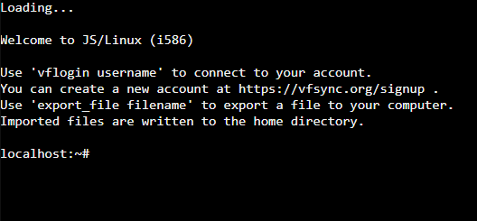
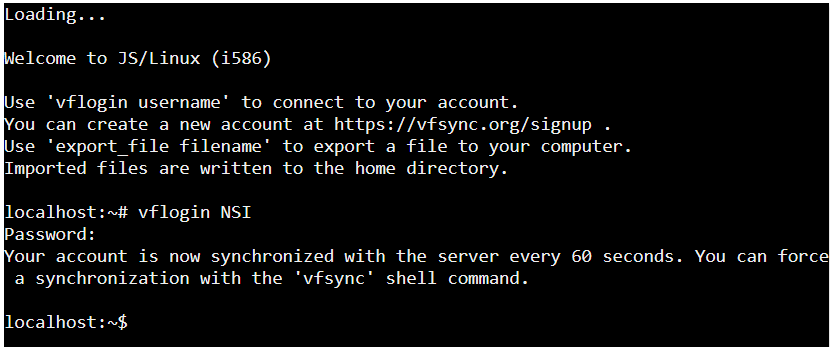
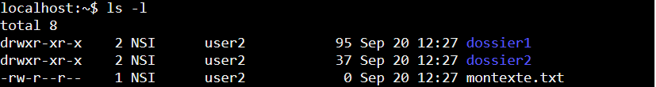
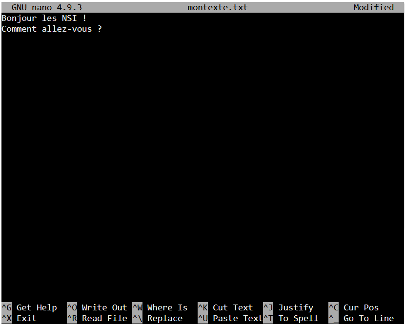

# TP — Utilisation d’une console shell  

## 1. Mise en route

Avec le jeu **TERMINUS**, vous avez découvert un certain nombre de commandes UNIX/Linux de façon ludique.

Ce second TP va vous permettre :

- de réutiliser ce que vous avez appris dans un contexte plus réaliste ;
- de découvrir d’autres commandes et options.

Pour cela, nous allons utiliser un émulateur en ligne.

### Étapes

1. Connectez-vous sur :  
   [https://bellard.org/jslinux](https://bellard.org/jslinux){target = "_blank"}

2. Cliquez sur **"click here"** sur la première ligne (Alpine Linux 3.23.2).


3. Connectez-vous sur :  
   [https://vfsync.org/signup](https://vfsync.org/signup){target = "_blank"}


4. Créez un compte en choisissant :

- un **User name**
- un **Password**

5. Revenez sur le terminal.

6. Saisissez :

```bash
vflogin username
```

puis appuyez sur **Entrée**

7. Saisissez votre mot de passe.

!!! warning "Attention"
    Le mot de passe n’apparaît pas à l’écran. C’est normal.



## 2. Prise en main des commandes UNIX/Linux de base

## 2.1 Arborescence de fichiers

L’arborescence de fichiers représente l’organisation des dossiers et fichiers sur un ordinateur.

Exemple :

```text
/
└── home
    └── NSI
        ├── dossier1
        │   └── fichier1.txt
        │   └── fichier2.txt        
        ├── dossier2
        └── montexte.txt
```

Dans cet exemple :

- `montexte.txt` est situé dans `/home/NSI`
- `fichier1.txt` est situé dans `/home/NSI/dossier1`


### Commandes utiles

| Commande | Description |
|---------|-------------|
| `pwd` | Affiche le répertoire courant |
| `mkdir dossier` | Crée un dossier |
| `touch fichier.txt` | Crée un fichier vide |
| `mv fichier.txt dossier` | Déplace un fichier |
| `mv fichier1 fichier2` | Renomme un fichier |
| `cp fichier1 fichier2` | Copie un fichier |
| `ls` | Liste le contenu du dossier |
| `cd dossier` | Entre dans un dossier |
| `cd ..` | Revient au dossier parent |
| `cd ~` | Retourne au dossier personnel |
| `rm fichier.txt` | Supprime un fichier |
| `rmdir dossier` | Supprime un dossier vide |
| `rm -r dossier` | Supprime un dossier non vide |

!!! tip "Astuce"
    Utilisez fréquemment `pwd` pour vérifier votre position dans l’arborescence.


### Exercice 2.1

#### Question 1.
Tapez :

```bash
pwd
```

Vérifiez que la réponse est de la forme :

```bash
/home/votre_login
```

#### Question 2.
À l’aide des commandes précédentes, recréez l’arborescence de l’exemple.

#### Question 3.

##### a)
Créez :

- un fichier `test.txt`
- deux répertoires `livre1` et `livre2`

##### b)
Dupliquez `test.txt` en :

- `test1.txt`
- `test2.txt`

##### c)
Déplacez `test1.txt` dans `livre1`

##### d)
Vérifiez le contenu de chaque répertoire

##### e)
Effacez les deux répertoires `livre1` et `livre2`


## 2.2 Gérer les droits

### Affichage détaillé

```bash
ls -l
```

Affiche le contenu du dossier de façon détaillée.

```bash
ls -al
```

Affiche également les fichiers cachés.


### Lecture d’un affichage

Exemple :

  

Dans l’ordre cela donne de gauche `a droite :
**droits - nombre de liens - nom du propriétaire - nom du groupe - taille en octet - date - heure - nom du fichier ou du répertoire**

Les systèmes de type UNIX sont des systèmes multi-utilisateurs.   Plusieurs utilisateurs peuvent donc partager un même ordinateur.  
Comme chaque utilisateur possède un environnement de travail qui lui est propre, chaque utilisateur possède certains droits lui permettant
d’effectuer certaines opérations et pas d’autres. Le système d’exploitation permet de gérer ces droits trés finement.  

Il faut cependant distinguer un utilisateur un peu particulier qui est autorisé à modifier tous les droits : ce "super utilisateur" est appelé "administrateur" ou "root".  

Au lieu de gérer les utilisateurs un par un, il est possible de créer des groupes d’utilisateurs. L’administrateur peut alors attribuer des droits à un groupe au lieu d’attribuer des droits particuliers à chaque utilisateur.  

Remarque : dans l’exemple donné ci-dessus, le nom du groupe est *user2* et celui du propriétaire *NSI*.  


Signification des droits :

- `-` → fichier
- `d` → dossier

Puis trois groupes de droits :

| Droit | Signification |
|------|---------------|
| `r` | lecture |
| `w` | écriture |
| `x` | exécution |
| `-` | droit absent |

### Exemple

Pour le fichier `montexte.txt` on a les droits `-rw-r--r--` :  

- le premier caractère `-` indique que c’est un fichier (pour un répertoire on aurait eu d) ;
- le premier `rw-` indique que propriétaire peut lire et écrire sur ce fichier mais il ne peut pas l’exécuter ;
- le deuxième `r--` indique que tous les utilisateurs du groupe peuvent lire sur ce fichier, mais ni écrire dessus, ni l’exécuter ;
- enfin `r--` indique que tous les autres utilisateurs peuvent uniquement lire le fichier.

### Modifier les droits

Pour changer les droits d’un fichier ou dossier, on utilise la commande `chmod` suivi d’un nombre composé de 3 chiffres puis du nom du fichier concerné.  
Pour savoir quel nombre on choisit il suffit de savoir compter en binaire.   
Par exemple :  
- `rwx` correspondra au nombre binaire `111` donc au nombre entier 7
- `rw-` correspondra au nombre binaire `110` donc au nombre entier 6
- `r--` correspondra au nombre binaire `100` donc au nombre entier 4

### Exercice 2.2

#### Question 1
Quel nombre choisir pour qu’un fichier soit :

- lisible par propriétaire et groupe
- exécutable par tous
- modifiable uniquement par le propriétaire

#### Question 2

Changez les droits de `dossier2` en :

```text
rwxrw-r--
```

#### Question 3
Tapez :

```bash
chown --help
```

À quoi sert cette commande ?

## 2.3 Éditer et écrire dans des fichiers

### Utilisation de `nano`

Ouvrir un fichier :

```bash
nano montexte.txt
```

Vous obtenez un éditeur de texte dans le terminal.



### Raccourcis utiles

| Raccourci | Action |
|----------|--------|
| `Ctrl + O` | Enregistrer |
| `Ctrl + X` | Quitter |

Le prompt affichant le nom de la machine disparaît ; vous avez à la place une page blanche où vous pouvez taper du texte. Le nom
du fichier que vous éditez et le nom de l’éditeur sont affichés en haut. La liste des commandes disponibles est écrite en bas.  

### Exercice 2.3

#### Question 1
Ouvrez :

```bash
nano montexte.txt
```

#### Question 2
Écrivez un texte puis quittez en enregistrant.

## 2.4 Commandes de fichiers

### Commande `cat`

#### Saisie libre

```bash
cat
```

Terminer avec :

```bash
Ctrl + D
```

#### Lire un fichier

```bash
cat fichier.txt
```

#### Écrire dans un fichier

```bash
cat > fichier.txt
```

### Exercice 2.4

Tester chacune de ces commandes dans l’émulateur.

## 2.5 Commandes de processus

### Voir les processus actifs

```bash
top
```

Quitter avec :

```bash
q
```

### Exécuter un script Python

```bash
python essai.py
```

### Forcer l’arrêt d’un processus

```bash
kill -9 1234
```

!!! danger "Attention"
    `kill -9` détruit immédiatement le processus ciblé.


### Exercice 2.5

#### Question 1
Lancez :

```bash
top
```

#### Question 2
Créez le script suivant :

```python
for i in range(20):
    print(i)
```

#### Question 3
Exécutez-le.


#### Question 4
Relancez :

```bash
top
```

# 3. Travail à rendre

Vous ne devez pas rendre tous les exercices précédents.

Seul l’exercice suivant est à rendre.

## Exercice 3.1 — À rendre

Arborescence :

```text
/
├── bin
│   ├── bash
│   └── cat
├── home
│   ├── alice
│   └── bob
│       ├── documents
|       |   ├── images
|       |   |   └── logo.png
│       │   ├── musique
│       │   |   ├── classique
│       │   |   └── rock
│       │   |       ├── track1.mp3
│       │   |       └── track2.mp3
│       │   ├── videos
│       │   └── mon_roman.docx
│       └── tmp
├── etc
└── usr
```

### Questions

1. Si je suis dans `documents`, qu’affiche `pwd` ?

2. Depuis `images`, quelle commande permet d’aller dans `musique` ?

3. Différence entre :

```bash
cp test1.txt test2.txt
```

et

```bash
mv test1.txt test2.txt
```

4. Que se passe-t-il avec :

```bash
rm videos
```
depuis `documents` ?

5. Quelle commande pour supprimer `rock` ?

6. Quelle commande affiche les droits de `mon_roman.docx` ?

7. Quelle commande pour que seul le propriétaire puisse lire et modifier `mon_roman.docx` (sans exécution) ?

8. Quelle(s) commande(s) permettent d’éditer un fichier texte ?

9. Comment exécuter `prog.py` ?

10. Quelle commande affiche les processus en cours ?


!!! success "Objectif"
    À la fin de ce TP, vous devez être autonome pour :

    - naviguer dans l’arborescence
    - créer/modifier/supprimer fichiers et dossiers
    - gérer les droits
    - éditer des fichiers
    - exécuter des scripts
    - observer les processus

