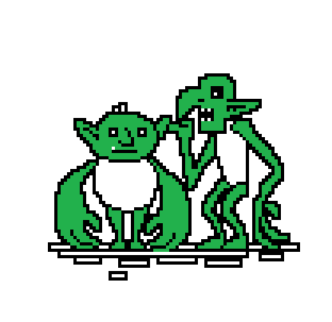

# 3.3 Découverte des commandes UNIX

{: .center}

A partir du jeu Terminus

{: .center}

Rendez-vous à l'adresse [http://luffah.xyz/bidules/Terminus/](http://luffah.xyz/bidules/Terminus/)

Acceptez le cookie, il gardera l'historique du jeu et vous permettra donc de le faire en plusieurs sessions.

Laissez-vous guider par le jeu, mais attention !  

- Vous devez noter sur un papier chaque nouvelle commande que vous apprenez. Vous pouvez par exemple construire un tableau de ce type :

{: .center}

- Sur une (plusieurs) copies doubles en mode paysage, établir un plan du jeu **au fur et à mesure** que vous avancez dans votre quête. Par exemple :
{: .center}

{: .center}

<!--
## Correction
Voici [un corrigé](data/Terminus-corrige.pdf) établi par Charles Poulmaire, de l'académie de Versailles.
-->