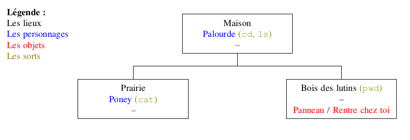

# 3.3 Découverte des commandes UNIX

{: .center}

A partir du jeu Terminus

{: .center}

Rendez-vous à l'adresse [http://luffah.xyz/bidules/Terminus/](http://luffah.xyz/bidules/Terminus/)

Acceptez le cookie, il gardera l'historique du jeu et vous permettra donc de le faire en plusieurs sessions.

Laissez-vous guider par le jeu, mais **ATTENTION** !  

- Vous devez noter sur feuille ou sur un document numérique chaque nouvelle commande que vous apprenez. Vous pouvez par exemple construire un tableau de ce type :

{: .center}
[modèle téléchargable](data/VotreNom_commandes_Linux.docx)

- Sur une (plusieurs) copies doubles en mode paysage ou à l'aide du modèle *drawio* donné, établir un plan du jeu **au fur et à mesure** que vous avancez dans votre quête. Par exemple :  

[modèle téléchargable](data/Votre_Nom_Plan_Terminus.drawio)  
[lien de l'application drawio](https://app.diagrams.net/?src=about)
{: .center}

{: .center}

