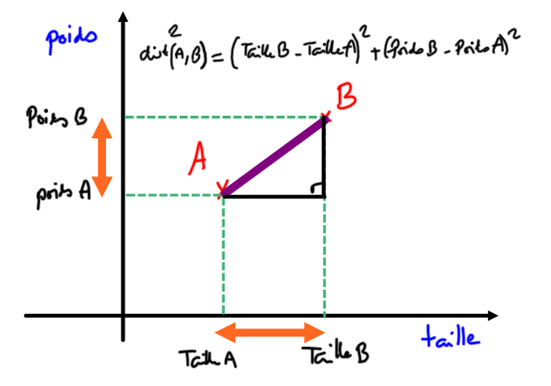

# 4.7 Algorithme des KNN

{: .center}

!!! abstract "Algorithme des K-Nearest-Neighbours (KNN), *aka les k-plus-proches-voisins* :heart:"
    La méthode KNN est une méthode simple et efficace de classification. La classification est un enjeu majeur de l'Intelligence Artificielle :

    - la caméra d'une voiture autonome perçoit un panneau, mais quel est ce panneau ?
    - un grain de beauté est pris en photo par un dermatologue, ce grain de beauté est-il cancéreux ?
    - ...

    La méthode du KNN va trouver quels sont, dans une base de données déjà bien remplie et labellée, les k-objets (les 6 objets si $k=6$ par exemple) qui se rapprochent le plus de l'objet à classifier. En prenant ensuite la caractéristique la plus fréquente parmi ces 6 objets, on devine alors dans quelle catégorie notre objet doit se classer.


    {: .center}


!!! note "Voici le lien du notebook sur lequel vous devez faire les exercices"
	[T4.7_KNN](https://capytale2.ac-paris.fr/web/c/94a6-1682854){: target = "_blank"} 

## 1. Objectif 
Nous allons reprendre le jeu de données sur les joueurs du Top14 utilisé [dans le cours «Trier et fusionner des données»](https://nsimichelet91.github.io/1NSI/T5_Traitement_de_donnees/5.2_Trier_et_fusionner_des_donnees/cours/){. target="_blank"}

Nous souhaitons pouvoir répondre à cette question :

!!! note "Question"
    Si on croise une personne (qu'on appelera joueur X) nous disant qu'elle veut jouer en Top14, et qu'elle nous donne son poids et sa taille, peut-on lui prédire à quel poste elle devrait jouer ?

Nous devons donc créer une fonction `conseil_poste` qui prend en argument `poids` et `taille` , qui sont les caractéristiques du joueur X. Cette fonction prendra aussi en paramètre un nombre ```k``` qui sera le nombre de voisins utilisés pour déterminer le poste conseillé.

La fonction doit renvoyer une chaîne de caractère correspondant au poste auquel on lui conseille de jouer.


Il va falloir pour cela classer tous les joueurs du Top14 suivant leur proximité morphologique avec notre joueur X, et prendre parmi les ```k``` premiers joueurs le poste majoritaire.


## 2. Fonction ```distance``` morphologique 

Dans toute idée de classification il y a l'idée de **distance**. Il faut comprendre la distance comme une _mesure de la différence_. 

Comment mesurer la différence physique entre deux joueurs de rugby ? 

{: .center}


!!! example "Fonction `distance`"
    Écrire une fonction ```distance``` qui reçoit en paramètres :

    - ```poids```  : le poids du joueur X
    - ```taille``` : la taille du joueur X
    - ```player```  : un joueur de la liste ```joueurs```

    et qui renvoie la distance morphologique du joueur X avec ```player```.

    **Exemple d'utilisation :**
    ```python
    >>> distance(93, 190, joueurs[34])
    445
    ```

## 3. Classement des joueurs suivant leur proximité morphologique

De la même manière qu'on avait [classé les joueurs suivant leur IMC](https://nsimichelet91.github.io/1NSI/T5_Traitement_de_donnees/5.2_Trier_et_fusionner_des_donnees/cours/#22-un-exemple-de-tri-de-dictionnaire){. target="_blank"}, on peut les classer suivant leur proximité morphologique avec le joueur X.

### 3.1 Fonction ```second```

!!! example "Fonction `second`"
    Écrire une fonction ```second``` qui reçoit en paramètres :

    - ```couple```  : un couple de valeurs

    et qui renvoie le deuxième élément du couple.

    **Exemple d'utilisation :**
    ```python
    >>> cpl = ("vendredi", 13)
    >>> second(cpl)
    13
    ```


### 3.2 Classement des k plus proches joueurs

!!! example "Fonction `classement_k_joueurs`"
    Écrire une fonction ```classement_k_joueurs``` qui reçoit en paramètres :

    - ```poids```  : le poids du joueur X
    - ```taille``` : la taille du joueur X
    - ```k``` : le nombre de joueurs les plus proches que l'on veut garder

    et qui renvoie une liste contenant les k joueurs classés suivant leur proximité morphologique avec le joueur X.

    **Exemple d'utilisation :**
    ```python
    >>> classement_k_joueurs(85, 186, 3)
    [{'Equipe': 'Bordeaux', 'Nom': 'Geoffrey CROS', 'Poste': 'Arrière', 'Date de naissance': '08/03/1997', 'Taille': '185', 'Poids': '85'}, {'Equipe': 'Toulouse', 'Nom': 'Romain NTAMACK', 'Poste': 'Ouverture', 'Date de naissance': '01/05/1999', 'Taille': '186', 'Poids': '84'}, {'Equipe': 'Bayonne', 'Nom': 'Manuel ORDAS', 'Poste': 'Ouverture', 'Date de naissance': '21/02/1998', 'Taille': '186', 'Poids': '83'}]
    ```

    

## 4. Recherche du poste le plus représenté

### 4.1 Dictionnaire d'occurence des postes

!!! example "Fonction `occurence`"
    Écrire une fonction ```occurence``` qui reçoit en paramètres :

    - ```joueurs```  : une liste de joueurs

    et qui renvoie le dictionnaire composé différents postes de ces joueurs, et du nombre de fois où ils apparaissent dans la liste ```joueurs```.

    **Exemple d'utilisation :**
    ```python
    >>> occurence(joueurs)
    {'Pilier': 110, 'Talonneur': 50, '2ème ligne': 74, '3ème ligne': 111, 'Mêlée': 42, 'Ouverture': 38, 'Centre': 71, 'Ailier': 64, 'Arrière': 35}
    ```


### 4.2 Tri d'un dictionnaire

!!! example "Fonction `cle_max`"
    Écrire une fonction ```cle_max``` qui reçoit en paramètre :

    - ```d```  : un dictionnaire dont les clés sont des chaines de caractère et les valeurs sont des nombres.

    et qui renvoie la clé associée à la valeur maximale.

    **Exemple d'utilisation :**
    ```python
    >>> d = {"lundi":13, "mardi":9, "mercredi":18, "jeudi":4}
    >>> cle_max(d)
    'mercredi'
    ```

   

### 4.3 Fonction ```conseil_poste```


!!! example "Fonction `conseil_poste`"
    Écrire une fonction ```conseil_poste``` qui reçoit en paramètres :

    - ```poids```  : le poids du joueur X
    - ```taille``` : la taille du joueur X
    - ```k``` : le nombre de joueurs les plus proches sur lequel on se base pour faire la prédiction

    et qui renvoie le poste le plus compatible avec la morphologie de X.

    **Exemple d'utilisation :**
    ```python
    >>> conseil_poste(70, 170, 6)
    'Mêlée'
    >>> conseil_poste(120, 210, 6)
    '2ème ligne'
    ```


Faire varier les différents paramètres pour observer leur rôle respectif.
