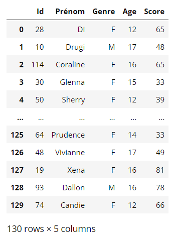
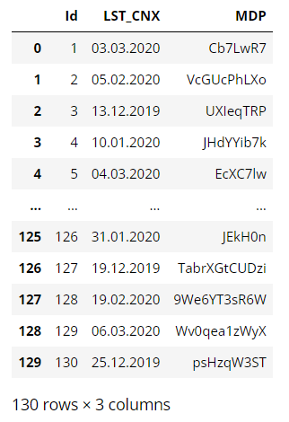

# 5.2 Trier et fusionner des données

{: .center}  


!!! note "Voici le lien du notebook sur lequel vous devez faire les exercices"
	[T5.2_csv_tri_fusion_cours](https://capytale2.ac-paris.fr/web/c/e3f8-1259933){: target = "_blank"}  


Nous reprenons notre fichier de joueurs de rugby du Top14. 


```python
import csv
f = open('top14.csv', "r", encoding = 'utf-8')
donnees = csv.DictReader(f)
joueurs = []
for ligne in donnees:
    joueurs.append(dict(ligne))
    
f.close()
```

## 1. Créer une fonction filtre
L'objectif est de créer une fonction `joueurs_equipe(equipe)` qui renvoie une liste contentant tous les joueurs de l'équipe `equipe`. 
Le paramètre `equipe` sera donnée sous forme de chaîne de caractères. 
La valeur renvoyée sera de type liste.

??? tip "réponse"
    ```python
    def joueurs_equipe(equipe):
        lst_joueurs = []
        for joueur in joueurs :
            if joueur['Equipe'] == equipe :
                lst_joueurs.append(joueur)
        
        return lst_joueurs

    ```

Exemple d'utilisation :


```python
>>> len(joueurs_equipe("Bordeaux"))
	37
```

Définir de la même manière une fonction `joueurs_poste(poste)`.


```python
def joueurs_poste(equipe):
    lst_joueurs = []
    
    for joueur in joueurs :
        if joueur['Poste'] == poste :
            lst_joueurs.append(joueur)
    
    return lst_joueurs

```


## 2. Utilisation d'une fonction de tri


### 2.1 Le problème
Comment classer les joueurs suivant leur taille ?
La fonction `sorted(liste)` est efficace sur les listes : elle renvoie une nouvelle liste triée dans l'ordre croissant.


```python
>>> mylist = [4,2,8,6]
>>> mynewlist = sorted(mylist)
>>> print(mynewlist)
	[2, 4, 6, 8]
```

  


Mais comment trier un dictionnaire ? 


```python
>>> test = sorted(joueurs)
```


    ---------------------------------------------------------------------------

    TypeError                                 Traceback (most recent call last)

    <ipython-input-14-de081d14a3da> in <module>
    ----> 1 test = sorted(joueurs)
    

    TypeError: '<' not supported between instances of 'dict' and 'dict'


Il est normal que cette tentative échoue : un dictionnaire possède plusieurs clés différentes.
Ici, plusieurs clés peuvent être des critères de tri : la taille, le poids.

### 2.2 Un exemple de tri de dictionnaire


```python
>>> Simpsons = [{"Prenom" : "Bart", "age estimé": "10"},
			   {"Prenom" : "Lisa", "age estimé": "8"},
			   {"Prenom" : "Maggie", "age estimé": "1"},
			   {"Prenom" : "Homer", "age estimé": "38"},
			   {"Prenom" : "Marge", "age estimé": "37"}]
```


```python
def age(personnage):
	return int(personnage["age estimé"])
```


```python
>>> age(Simpsons[0])
   10
```


La création de cette fonction `age()` va nous permettre de spécifier une clé de tri, par le paramètre `key` :

!!! note "Tri d'un dictionnaire :heart:"
    ```python
    >>> triSimpsons = sorted(Simpsons, key = age)
    ```


```python
>>> triSimpsons
    [{'Prenom': 'Maggie', 'age estimé': '1'},
     {'Prenom': 'Lisa', 'age estimé': '8'},
     {'Prenom': 'Bart', 'age estimé': '10'},
     {'Prenom': 'Marge', 'age estimé': '37'},
     {'Prenom': 'Homer', 'age estimé': '38'}]

```


On peut aussi inverser l'ordre de tri :


```python
>>> triSimpsons = sorted(Simpsons, key = age, reverse = True)
>>> triSimpsons
    [{'Prenom': 'Homer', 'age estimé': '38'},
     {'Prenom': 'Marge', 'age estimé': '37'},
     {'Prenom': 'Bart', 'age estimé': '10'},
     {'Prenom': 'Lisa', 'age estimé': '8'},
     {'Prenom': 'Maggie', 'age estimé': '1'}]

```


!!! abstract "Exercice 1"
    === "Énoncé"
        Trier les joueurs du top14 par taille.
    === "Correction"
        ```python
        def taille_joueur(joueur) :
			return int(joueur['Taille'])
			
        >>> joueurs_taille_croissant = sorted(joueurs, key = taille_joueur)
        ```

!!! abstract "Exercice 2"
    === "Énoncé"
        Trier les joueurs du top14 par poids.
    === "Correction"
        ```python
        def poids_joueur(joueur) :
            return int(joueur['Poids'])
			
        >>> joueurs_poids_croissant = sorted(joueurs, key = poids_joueur)
        ```
!!! abstract "Exercice 3"
    === "Énoncé"
        Trier les joueurs de Bordeaux suivant leur Indice de Masse Corporelle ([IMC](https://fr.wikipedia.org/wiki/Indice_de_masse_corporelle) )
    === "Correction"
        ```python
        def IMC(joueur):
			masse = int(joueur['Poids'])
			taille_m = int(joueur['Taille']) / 100
			return masse / taille_m**2
			
        >>> joueurs_UBB = [joueur for joueur in joueurs if joueur['Equipe'] == 'Bordeaux']
        >>> joueurs_UBB_tri = sorted(joueurs_UBB, key = IMC)
		>>> for joueur in joueurs_UBB_tri:
				print(joueur['Nom'], IMC(joueur))
			Yann LESGOURGUES 23.450918219051392
			Nicolas PLAZY 24.049343594386603
			Matthieu JALIBERT 24.382716049382715
			Blair CONNOR 24.48565200513601
			Geoffrey CROS 24.835646457268076
			Maxime LUCU 25.2162533116282
			Jean-Baptiste DUBIÉ 25.94548395958609
			Romain BUROS 26.023048986244955
			Santiago CORDERO 26.493025631204315
			Alexandre ROUMAT 26.527905315784103
			Cameron WOKI 26.81174510620575
			Lucas MÉRET 26.82742078020452
			Nans DUCUING 27.471688898385274
			Ulupano SEUTENI 27.757487216946675
			Clément MAYNADIER 28.59675712774171
			Cyril CAZEAUX 28.823589429650035
			Alexandre FLANQUART 28.835063437139564
			Semi RADRADRA 28.85921231326392
			Scott HIGGINBOTHAM 28.928336620644316
			Ben BOTICA 29.352354500694357
			Béka GORGADZE 29.394473838918284
			Mahamadou DIABY 29.708012675418743
			Masalosalo TUTAIA 30.036524413687044
			Jandré MARAIS 30.09896949290889
			Kane DOUGLAS 30.144103519262817
			Seta TAMANIVALU 30.794210688390585
			Rémi LAMERAT 31.01370510396975
			Marco TAULEIGNE 31.523258682601902
			Afa AMOSA 32.028367983070716
			Laurent DELBOULBÈS 32.35554470254266
			Adrien PÉLISSIÉ 33.576508653582
			Lasha TABIDZE 34.18553688823959
			Lekso KAULASHVILI 34.31610855329005
			Peni RAVAI 34.76990504017531
			Jefferson POIROT 35.713195567900854
			Vadim COBILAS 36.41975308641975
			Thierry PAÏVA 36.92107750472589
		
			
        ```

## 3. Recherche des joueurs de profil physique similaire

### 3.1 Distance entre deux joueurs
Construire une fonction `distance(joueur1,joueur2)` qui renvoie la somme des carrés des différences de tailles et de poids entre les joueurs `joueur1` et `joueur2` : 
$$ d = (p_1-p_2)^2 + (t_1-t_2)^2$$


??? tip "réponse"
    ```python
	def distance(joueur1,joueur2):
		p1 = int(joueur1['Poids'])
		p2 = int(joueur2['Poids'])
		t1 = int(joueur1['Taille'])
		t2 = int(joueur2['Taille'])
		return (p1 - p2)**2 + (t1 - t2)**2
    ```

### 3.2 Distance des joueurs avec Baptiste Serin

Retrouvons d'abord le numéro de Baptiste Serin dans notre classement de joueurs :


```python
>>> for i in range(len(joueurs)) :
		if joueurs[i]['Nom'] == 'Baptiste SERIN' :
			print(i)	
	530
```

```python
>>> joueurs[530]
	{'Equipe': 'Toulon',
     'Nom': 'Baptiste SERIN',
     'Poste': 'Mêlée',
     'Date de naissance': '20/06/1994',
     'Taille': '180',
     'Poids': '79'} 
```

Nous pouvons maintenant classer les joueurs suivant leur distance morphologique à Baptiste  SERIN :

```python
>>> def distance_Serin(joueur2):
		return distance(joueurs[530], joueur2)
```

```python
>>> distance_Serin(joueurs[530])
	0
```

```python
>>> joueurs_VS_Serin = sorted(joueurs, key = distance_Serin)
```

```python
>>> joueurs_VS_Serin
```

## 4. Fusionner des données (fusion de tables)

Nous disposons de deux tables : une table avec les scores de joueurs à un jeu en ligne et une table avec les dates de leur dernière connexion et leurs mots de passe :  

Table des scores :  
{: .center}  

Table des connexions :
{: .center}  

On cherche à fusionner les deux tables, c'est à dire à n'en faire qu'une seule qui réunit les informations des deux tables.

Pour cela, il y a une précondition à vérifier concernant le champ `Id` (identifiant) qui est le descripteur commun aux deux tables :

**Deux adolescents différents ne peuvent avoir le même champ `Id` (logique : c'est leur numéro d'identifiant)**

L'algorithme de fusion présenté ici est l'algorithme naïf en langage naturel :

```python
table_fusion = []
Pour chaque dico_score de table_scores :
	Pour chaque dico_connex de table_connexions :
		Si dico_score['Id'] == dico_connex['Id']:
			Faire une copie de dico_ado
			Ajouter les champs 'LST_CNX' et 'MDP' à la copie de dico_ado
			Ajouter la copie de dico_ado à table_fusion
```
ce qui donne en python :

```python
import copy

table_fusion = []

for ado in table_scores:
    for connex in table_connexions:
        if connex['Id'] == ado['Id']:
            ado_copie = copy.deepcopy(ado)
            ado_copie['LST_CNX'] = connex['LST_CNX']
            ado_copie['MDP'] = connex['MDP']
            table_fusion.append(ado_copie)
            break
            
afficher(table_fusion)
```
{: .center}

***Point de vigilance :***

Si la table des connexions contenait **toutes** les connexions des joueurs et **pas seulement leur dernière** connexion, un même `'Id'` pourrait être présent plusieurs fois dans la table des connexions. Dans ce cas l'algorithme fonctionne encore à condition de supprimer la ligne `break` : on se force ainsi - pour chaque identifiant - à parcourir toute la table des connexions au lieu de s'arrêter dès qu'on trouve la première connexion correspondant à l'identifiant.

*Remarque :* Ici chaque 'Id' de la table des scores est présent dans la table des connexions (ce qui est logique car il faut s'être connecté pour jouer et obtenir un score). Néanmoins, si certains scores n'avaient pas été présents dans la table des connexions, l'algorithme aurait tout de même fonctionné.

### 5. Exercices

!!! note "Voici les liens des notebooks des exercices"
	- [T5.2_csv_tri_fusion_achats](https://capytale2.ac-paris.fr/web/c/1389-1257970){: target = "_blank"}    
	- [T5.2_csv_tri_fusion_animaux](https://capytale2.ac-paris.fr/web/c/6839-1258032){: target = "_blank"}   