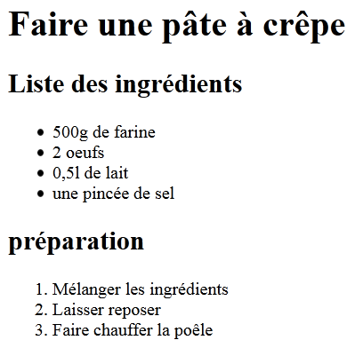
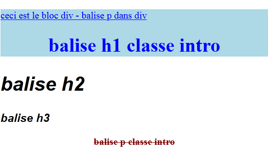

# 6.1 Les langages HTML5 et CCS3

## Présentation
Les langages HTML et CSS sont des **langages syntaxiques de description**, par opposition aux langages de programmation que sont Python, Java, C ,...   
Ils sont interprétés par les navigateurs des ordinateurs, tablettes ou autres smartphones.  

{ style="width:60%; margin-left:20%;"}

En HTML, les discriptions sont définies par des balises (tag en anglais).   
Chaque balise a une signification précise.  
On peut associer des attibuts aux balises.
!!! Example "Exemple "
	``` html
	<h1> Mon super site </h1>
	```
	
	- Le **bloc** `h1` est défini par la balise ouvrante `<h1>` et la balise fermante `</h1>`.  
	- Toutes les balises doivent être fermées, afin de définir la fin du bloc.   
	- La balise `<h1>` (header en anglais) définit un titre de niveau 1.   
	- Le contenu du bloc `h1` est donc un titre de niveau 1 et sera afficher comme tel.   
	- Il existe 6 niveaux de titre, depuis `h1` jusqu'à `h6`.  
	
!!! Example "Autre exemple "
	``` html
	
	```
	
	- La balise `` est une balise auto-fermante : pas de balise `</img>` mais `/>` à la fin de la balise pour la fermer.
	- La balise `` permet d'afficher une image dans le navigateur.  
	
	- `class`, `src` et `alt` sont des attributs de la balise.   
		* L'attribut `class` permet d'associer des propriétés d'affichage au sein de la feuille de style,  
		* L'attribut `src` (source) définit le chemin d'accès au fichier image,  
		* L'attribut `alt` définit le texte à afficher si l'image n'est pas trouvée.  

### Intérêt des pages HTML
Les pages HTML sont interprétées par des navigateurs.  
Ce qui en fait un format universel.  
Afin de s'adapter à toutes les tailles d'écran les pages web doivent-être **Responsive Web Design**.  


### Les éditeurs de texte
 
!!! Note "Quelques éditeurs gratuits : " 

	- Notepad++,  
	- SublimText,
	- Capytale,
	- Geany,
	- VSCodium, 
	- et beaucoup d'autres.  
	
### Organisation des fichiers dans le répertoire racine
{ style="width:20%; float:right;" }  
Le nombre de fichiers augmentant rapidement, il est nécessaire de classer les fichiers utilisés par type.  
On utilisera au minimum cette arborescence.


## HTML : le contenu
### Structure d'un fichier HTML
!!! Note "Tous les fichiers HTML doivent respecter cette structure :"
	``` html
	<!-- Ceci est un commentaire -->

	<!DOCTYPE html>	    <!-- définit le type de langage utilisé : ici le HTML5 -->					

	<html lang="fr">	<!-- ouverture du bloc "html" - Langue : français -->								
		<head>									
						<!-- contenu du bloc "head" -->
		</head>									
		<body>	
						<!-- contenu du bloc "body" -->
		</body>
	</html>             <!-- fermeture du bloc "html" -->
	```

	- **`<!DOCTYPE HTML>`** précise que le ficher contient du HTML5
	- **`<html lang="fr">`** ouverture du bloc `html` qui englobe tout
	- **Bloc `<head>`** : entête. Contient la configuration de la page html, des metadonnées et autres informations utiles aux navigateur et moteurs de recherche. 
	- **Bloc `<body>`** : corps de la page. Contient toutes les informations à afficher.  

### Liste de balises HTML
!!! Note "**Le bloc `head`** - Les balises d'entête"

	``` html
	<head>
		<title>Spécialité NSI</title>
		<meta charset="UTF-8"/>
		<link rel="stylesheet" href="css/style.css"/>
		<link rel="icon" type="image/png" href="images/favicon.png"/>
		<script src="js/script.js"> </script>
	</head>
	```

	- **`<meta charset="utf-8"/>`** définit l’encodage des caractères (affichage correct des lettres accentuées).
	- **`<title>Spécialité NSI</title>`** définit le nom de la page dans l’onglet du navigateur.
	- **`<link rel="stylesheet" href="css/style.css"/>`**  indique l’utilisation d’une feuille de style et son chemin d'accès.
	- **`<link rel="icon" type="image/png" href="images/favicon.png"/>`** affiche une icone à gauche de l'onglet.
	- **`<script src="js/script.js"></script>`** indique l’utilisation d’un script de type JavaScript et son chemin d'accès.
<br>


!!! Note "**Le bloc `body`** - les balises de structure"
	{ style="width:30%; float:right;" } 

	- **`<nav>`** contient la navigation dans le site.
	- **`<header>`** et **`<footer>`** définit l’entête et le pied de page.
	- **`<section>`**, **`<article>`** et **`<aside>`** organisent les différentes parties spécifiques à la page.
	- **`<div>`** balise générique qui définit un bloc sans lui donner de sens particulier. En général on lui donne un attribut 
	d’identifiant `id` ou de classe `class` auquel on associe des propriétés d'affichage dans la feuille de style.
<br>


!!! Note "**Le bloc `body`** - les balises de texte"
	Il existe deux catégories de balise:

	- les balises de type `bloc` qui force le passage à la ligne avant et après le bloc.  
	- les balises `inline` qui autorise le positionnement sur la même ligne.

	!!! Note "Exemple de balises HTML de texte"

		- **`<h1>`**, **`<h2>`**, **`<h3>`**,**`<h4>`**, **`<h5>`** et **`<h6>`** : balises `bloc` pour les titres du texte.  
		- **`<p>`** balise `bloc` qui définit un paragraphe (espace avant et après le texte).  
		- Les balises `inline` de mise en forme :   
			- **`<em>`**, (emphasis) pour mettre en valeur (italique),  
			- **`<strong>`**, pour mettre en valeur (gras),  
			- **`<code>`**, pour afficher du code informatique,  
			- **`<sup>`**, pour mettre du texte en exposant,  
			- **`<sub>`**, pour mettre du texte en indice,  
			- **`<span>`**, balise générique, comme la balise **`div`** mais de type `inline`. Les propriétès associées sont à définir dans la feuille de style.

	!!! Example "Rendu de balises de texte"
		{ style="width:45%; float:right;" } 
		``` html
		<body>
			<h1>Titre de niveau 1</h1>		
			<h2>Titre de niveau 2</h2>
			<h3>Titre de niveau 3</h3>
			<h4>Titre de niveau 4</h4>
			<h5>Titre de niveau 5</h5>
			<h6>Titre de niveau 6</h6>
			<p> 
				Ceci est un  paragraphe. Il force le passage à la ligne et 
				met en place des espacements avec les éléments au dessus et 
				au dessous (margin et padding). 
			</p>
			<p> 
				Mise en place des balises in-line : 
				<em>emphasis</em>, <strong>strong</strong>, <code>code</code>
				<sup>sup</sup>, <sub>sub</sub> et 
				<span style="color:red"> span : balise générique - pas de 
				propriétés pas défaut) </span>
			</p>
		</body>
		```
<br>


!!! Note "**Le bloc `body`** - les listes : 2 types de liste"

	- les listes non numérotées , introduites par **`<ul>`**,   
	- les listes numérotées , introduites par **`<ol>`**,  
	- Chaque item d'une liste sont introduit par **`<li>`**.  
	!!! Example "Exemple de listes"
		{ style="width:30%; float:right;" } 

		``` html
		<body> 
			<h1> Faire une pâte à crêpe </h1>
			<h2> Liste des ingrédients </h2>
			<ul>
				<li> 500g de farine </li>
				<li> 2 oeufs </li>
				<li> 0,5l de lait </li>
				<li> une pincée de sel </li>
			</ul>
			<h2> préparation </h2>
			<ol>
				<li> Mélanger les ingrédients </li>
				<li> Laisser reposer </li>
				<li> Faire chauffer la poêle </li>
			</ol>
		</body>
		```
<br>


!!! Note "**Le bloc `body`** - Les tableaux avec entête"
	- **`<table>`** déclare le tableau,   
	- **`<tr>`** (table row) définit une ligne du tableau,  
	- **`<th>`** (table header) définit une cellule d'entête du tableau. 
	- **`<td>`** (table data) définit une cellule de donnée du tableau.  
	 
	!!! Example "Exemple de tableau"
		{ style="width:40%; float:right;" } 

		``` html
		<body> 
			<table>
				<tr>
					<th> Prénom </th>
					<th> Nom </th>
					<th> Age </th>
				</tr>
				<tr>
					<td> Alain </td>
					<td> Térieur </td>
					<td> 50 </td>
				</tr>
				<tr>
					<td> Paul </td>
					<td> Auchon </td>
					<td> 94 </td>
				</tr>
				<tr>
					<td> Jean </td>
					<td> Raffole </td>
					<td> 80 </td>
				</tr>
			</table>
		</body>
		```
<br>			
			
			
!!! Note "**Le bloc `body`** - Les liens hypertextes"
	La balise **`<a>`** définit un lien hypertexte.
	
	=== "Exemples de syntaxes de liens hypertextes"

		- On peut définir une URL comme lien : description d'un chemin absolu.
		``` html 
			<a href="https://nsimichelet91.github.io/1NSI"> Site 1NSI du lycée</a>
		```

		- On peut définir un chemin relativement au répertoire courant : description d'un chemin relatif.
		``` html 
			<a href="../page1.html"> Aller vers la page1 </a>
		```

		- On peut valider le lien en cliquant sur une image.
		``` html 
			<a href="https://nsimichelet91.github.io/1NSI"> </a>
		```

		- On peut faire apparaît un label lors du survol du lien.
		``` html 
			<a href="https://nsimichelet91.github.io/1NSI" title="Site 1NSI du lycée"> 1NSI </a>
		```
	
	=== "Rendu des exemples"
	
		<a href="https://nsimichelet91.github.io/1NSI"> Site 1NSI du lycée</a>
		
		<a href="../page1.html"> Aller vers la page1 </a>
		
		[](https://nsimichelet91.github.io/1NSI)
		
		<a href="https://nsimichelet91.github.io/1NSI" title="Site 1NSI du lycée"> 1NSI </a>
<br>


## CSS : l'apparence
{ style="width:40%; float:right;" } 
Le HTML définit **le contenu** de la page,  
Le CSS définit **l’apparence** (le style).  
3 façons de d’appliquer un style à une balise :

- dans la balise elle-même en utilisant l’attribut style,  
- dans le bloc `<head>` du code html à l’aide d’une balise `<style>`,  
- à part, dans un fichier ayant une extension `*.css` **&#x27A4; à privilégier**.  


### CSS : les sélecteurs

!!! Note "CSS : les sélecteurs"
	Les sélecteurs ciblent les éléments HTML auxquels on va attribuer des propriétés.  
	<br>
	{ style="width:25%;" } 
	
	!!! Note "Syntaxe pour les sélecteurs "

		| Type de sélecteur | Exemple | Description |
		| :-------: | :-----: | :---------: |
		| `balise` | `p` | Sélectionne toutes les balises `<p>` | 
		| `.class` | `.intro` | Sélectionne toutes les balises contenant l’attribut `class="intro"` |  
		| `#id` | `#date` | Sélectionne la balise contenant l’attribut `id=“date"` |   
		| `sélecteur, sélecteur` | `div, p` | Sélectionne les 2 sélecteurs (balises `<div>` et `<p>`) | 
		| `balise balise` | `div p` | Sélectionne toutes les balises `<p>` contenues dans les balises `<div>` | 
		| `balise.class` | `p.intro` | Sélectionne les balises `<p>` contenant l’attribut `class="intro”` |  

	!!! Example "Exemple d'utilisation"
		<table>
			<tr>
				<td>
				Fichier `index.html`
				``` html
				<!DOCTYPE html>								
				<html lang="fr">										
					<head>									
						<meta charset="utf-8" />			
						<link rel="stylesheet" href="style.css" />		  	
					</head>									
					<body>		
						<div id="page">
							<p>	ceci est le bloc div - balise p dans div </p>
							<h1 class="intro">
								balise h1 classe intro
							</h1>
						</div>
						<h2> balise h2 </h2>
						<h3> balise h3 </h3>
						<p class="intro">
							balise p classe intro
						</p>	
					</body>									
				</html>
				```
				</td>
				<td>
				Fichier `style.css`
				``` css
				h2 {
					font-size: 2em;
					}

				#page {
					color:blue;
					background-color : lightblue;
					}

				.intro {
					text-align: center;
					}
					
				h2, h3 {
					font-style:italic;
					font-family: arial;
					}

				div p {
					text-decoration: underline;
					}

				p.intro {
					color : maroon;
					font-weight: bold;
					text-decoration: line-through
					}
				```
				</td>
			</tr>
		</table>
		{ style="width:40%; margin-left:30%" }

### Liste de propriétés CSS		

!!! Note "CSS : les propriétés CSS dédiées au texte"   

	| Nom de la propriété | Valeurs possibles | Remarque |
	| :-------: | :-----: | :---------: |
	| `color` | Code couleur | Définit la couleur du texte | 
	| `background-color` | Code couleur | Définit la couleur de fond de l'élément HTML | 
	| `font-family` | Nom de la police de caractère | Définit la police à utiliser |  
	| `font-size` | Valeur numérique | Définit la taille de la police |   
	| `font-style` | `normal`, `italic` ou `oblique` | | 
	| `font-weight` | `normal` ou `bold` | `bold` affiche les caractères en **gras** | 
	| `text-decoration` | `None`, `line-through` ou `underline` |  |  
	| `line-height` | Valeur numérique | Définit la hauteur minimale de la ligne |  
	| `text-indent` | Valeur numérique | Définit l'indentation (c'est à  dire le retrait de la 1ère ligne) |  
<br>

!!! Note "CSS : les propriétés CSS dédiées au blocs"  
	{ style="width:40%; margin-left:30%;" }  
	
	!!! Note "Extrait de propriétés dédiés au bloc"

		| Propriété | Valeurs possibles | Remarque |
		| :-------: | :-----: | :---------: |
		| `margin` | Valeur numérique | Définit l'épaisseur de la marge extérieure | 
		| `padding` | Valeur numérique de caractère | Définit l'espace entre le contenu et la bordure (marge intérieure) |  
		| `border-width` | Valeur numérique (0 par défaut) | Définit l'épaisseur de la bordure |   
		| `border-style` | `solid`, `dashed`, `dotted`, `groove` ou  `ridge`, par défaut `None` | Définit le style de la bordure | 
		| `border-color` | Code d'une couleur | Définit la couleur de la bordure | 
		| `border-radius` | Valeur numérique | Définit le rayon de l'arrondi des coins du cadre |  
		| `border` | `width` `style` `color` | Définit la largeur, le style et la couleur en une seule fois |  

	!!! Example "Exemple d'utilisation"
		<table>
			<tr>
				<td>
				Fichier `index.html`   
					``` html
						<!DOCTYPE html>								
						<html lang="fr">										
							<head>									
								<meta charset="utf-8" />			
								<link rel="stylesheet" href="style.css" />		  	
							</head>	
							<body>
								<table>
									<tr>
										<td>
											
										</td>
										<td>		
											<h1 id="titre"> Mes belles vacances </h1> 
										</td>
										<td>
											 
										</td>
									</tr>
								</table>
							</body>
						</html>
					```
				</td>
				<td>
				Fichier `style.css`   
				``` css
					td {
						border: 1px dotted black;
					}

					#titre {
						border: 20px solid lightblue;
						border-style: outset;
						padding:40px;
						margin:20px;
					}

					#photo1 {
						border: 15px solid lightgrey;
						border-radius : 50px;
						margin-left: 30px;
					}	

					#photo2 {
						border: 5px dashed blue;
						border-radius: 50%;
						padding:10px;
						margin-right:30px;
					}
				```
				</td>
			</tr>
		</table>
		{ style="width:60%; margin-left:20%;" }
<br>

				
<!---

!!! Note "CSS : les pseudo-classes"  
	Les pseudo-classes sont utilisées pour cibler un état particulier pour un élément.

	| La pseudo-classe | Exemple | Description |
	| :-------: | :-----: | :---------: |
	| `:link` | `a:link { color:bleu; }` | Sélectionne le lien non visité | 
	| `:visited` | `a:visited { color:red; }` | Sélectionne le lien visité |  
	| `:hover` | `a:hover { color:hotpink; }` | Sélectionne le lien survolé par la souris |   
	| `:active` | `a:active { color:green; }` | Sélectionne le lien actif | 
	| `:focus` | `input:focus` | Sélectionne la balise `<input>` ayant le focus | 
	| `:required` | `input:required` | Sélectionne les balises `<input>` à remplir obligatoirement |  
	
	Voir l'exemple d'utilisation sur le site de [W3schools.com](https://www.w3schools.com/css/css_pseudo_classes.asp).
-->
<br>
## Les liens utiles

[Khan-academy : un tuto pour les personnes qui débutent](https://fr.khanacademy.org/computing/computer-programming/html-css)

[Ostralo.net : Une bonne synthèse](http://numerique.ostralo.net/html_css)

[OpenClassRoom : un tuto très complet](https://openclassrooms.com/fr/courses/1603881-apprenez-a-creer-votre-site-web-avec-html5-et-css3)

[W3school : pour retrouver une information ou tester un exemple.](https://www.w3schools.com)


