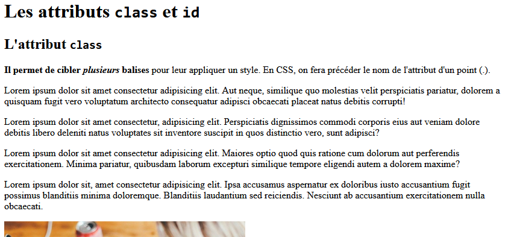
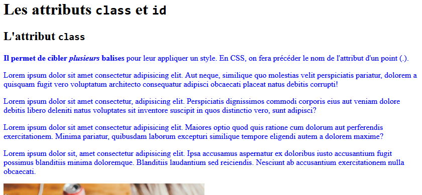
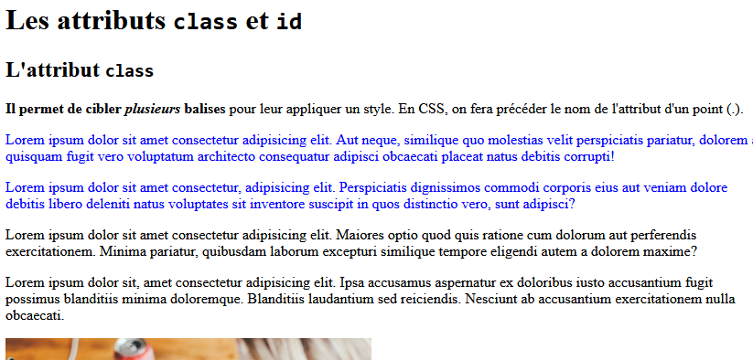
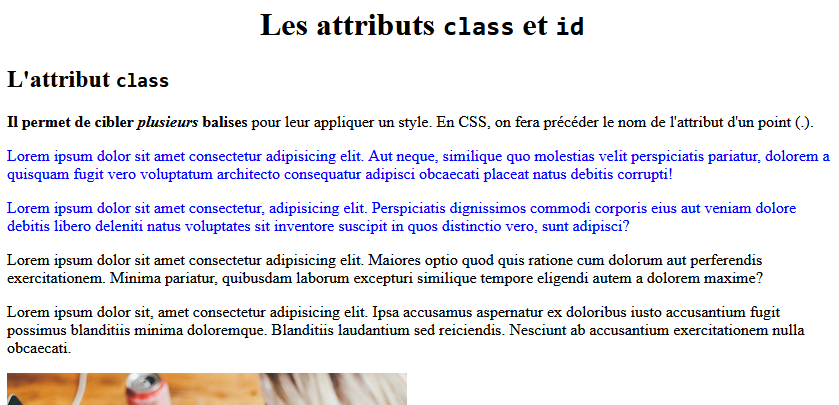

# Introduction aux attributs `class` et `id`

## Présentation

L'objectif de cette activité est de comprendre le rôle des attributs `class` et `id` dans les éléments HTML.  
Ces attributs sont utilisés pour appliquer des styles CSS ou pour interagir avec des scripts JavaScript.

Dans cette activité, nous allons nous concentrer sur leur **utilisation avec le langage CSS**.

!!! note "Voici le lien de l'activité sur Capytale"
	[T6.2_Introduction aux attributs "class" et "id"](https://capytale2.ac-paris.fr/web/c/70d7-6702855){: target = "_blank"}
	
La page `index.html` contient le début de code suivant :

**Code HTML de départ :**

```html
<!DOCTYPE html>
<html>
  <head>
    <meta charset="utf-8">
    <meta name="viewport" content="width=device-width">
    <title>Activité d'introduction</title>
    <link href="style.css" rel="stylesheet" type="text/css" />
  </head>
  <body>
    <h1>Les attributs <code>class</code> et <code>id</code></h1>
    <h2>L'attribut <code>class</code></h2>
    <p><strong>Il permet de cibler <em>plusieurs</em> balises</strong> pour leur appliquer un style.</p>
    <p>Lorem ipsum dolor sit amet consectetur adipisicing elit...</p>
    <p>Lorem ipsum dolor sit amet consectetur, adipisicing elit...</p>
    <p>Lorem ipsum dolor sit amet consectetur adipisicing elit...</p>
    <p>Lorem ipsum dolor sit, amet consectetur adipisicing elit...</p>
  </body>
</html>
```
La page s'affiche de cette manière dans le navigateur :  

{: .center}

## Application de style avec `class`
Si on écrit le code CSS suivant dans le fichier style.css (associé à notre fichier HTML)

**Code CSS :**

```css
p {
  color: blue;
}
```

Tous les paragraphes sont affichés en bleu.
{: .center}

Les attributs `class` et `id` vont permettre de cibler uniquement certains éléments d'une page pour les styliser ou les manipuler : par exemple, on va pouvoir cibler un ou plusieurs paragraphes précis pour leur appliquer un style, qui ne s'appliquera pas aux autres.  

### L'attribut `class`
!!! note
	L'attribut `class` permet de cibler plusieurs éléments HTML. Les classes permettent de manipuler les éléments via CSS ou JavaScript.

**Exemple**: On souhaite cibler **uniquement les deux premiers paragraphes en latin**.  
Pour cela, on commence par définir une classe pour ces deux premiers paragraphes :  

**HTML :**

```html
<p class="para-bleu">Lorem ipsum dolor sit amet consectetur adipisicing elit...</p>
<p class="para-bleu">Lorem ipsum dolor sit amet consectetur, adipisicing elit...</p>
```  

On peut alors appliquer un style CSS à cette classe. Il faut faire précéder le nom de la classe par un `.` en CSS :
**CSS :**

```css
.para-bleu {
  color: blue;
}
```
On obtient alors la page suivante :
{: .center}

## L'attribut `id`

!!! note
	L'attribut `id` permet de cibler un élément HTML. Il s'agit d'un identifiant qui doit être unique pour l'ensemble du document. Il permet d'identifier un élément que l'on souhaite mettre en forme avec CSS ou manipuler avec un script.
	
**Exemple** :On veut centrer uniquement le **premier titre de niveau h1**.

Pour cela, on commence par définir un attribuer un identifiant à ce titre :
**HTML :**

```html
<h1 id="titre-principal">Les attributs <code>class</code> et <code>id</code></h1>
```

On peut alors appliquer un style à ce titre grâce à son attribut `id`. Il faut faire précéder le nom de l'identifiant par un `#` en CSS :  

**CSS :**

```css
#titre-principal {
  text-align: center;
}
```  

On obtient alors la page suivante :
{: .center}

## 🎯 Défis à réaliser

1. Les titres de niveau 2 `"L'attribut class"` et `"L'attribut id"` doivent être centrés et en bleu.
2. Les 4 paragraphes précédant la première image doivent être écrits en rouge.
3. Le **deuxième titre de niveau 1** doit avoir une **taille de police égale à 50px**.
4. Le **dernier paragraphe de chaque partie** doit être **aligné à droite**.
5. Seul le **premier titre de niveau 2** doit être en **blanc sur fond noir au survol de la souris**. (Voir le pseudo-sélecteur `:hover`)
6. La **deuxième image uniquement** doit être centrée.

## Pour aller plus loin

Maîtriser les balises `<div>` et `<span>`, la mise en page avec **Flexbox** et **Grid Layout**, ainsi que la sélection d'éléments, est essentiel pour styliser des pages complexes.

🎥 [Vidéo explicative sur les balises `<div>` et `<span>`](https://youtu.be/_QJx7gOt5iU)

📚 Documentation MDN :
- [Balise `<div>`](https://developer.mozilla.org/fr/docs/Web/HTML/Element/div)
- [Balise `<span>`](https://developer.mozilla.org/fr/docs/Web/HTML/Element/span)

## Mise en page avancée

Deux modèles sont à privilégier :

- **Flexbox** : [Flexbox Froggy](https://flexboxfroggy.com/#fr)
- **Grid Layout** : [Grid Garden](https://cssgridgarden.com/#fr)

🎓 Tutoriels conseillés :

- **Flexbox** :
  - [Débutant - Graven](https://youtu.be/2qA4mobfcK0)
  - [Avancé - Grafikart](https://grafikart.fr/tutoriels/flexbox-806)
  - [SwebDev](https://youtu.be/UcC76tcvLgA)

- **Grid Layout** :
  - [Grid CSS - Grafikart](https://grafikart.fr/tutoriels/grid-css-1002)
  - [Float, Flex ou Grid ?](https://grafikart.fr/tutoriels/float-flex-grid-2017)

## Sélection CSS complexe

Quand les balises deviennent nombreuses et imbriquées, il est plus difficile de les cibler en CSS.

🕹️ [Jeu interactif CSS Diner (anglais)](https://flukeout.github.io/#)

---

*Germain Becker, Lycée Emmanuel Mounier, Angers*  
{: .center width=10%}

