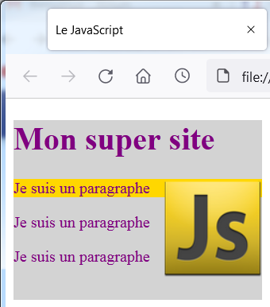
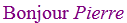

# Le Javascript, ou JS

## Présentation
JavaScript a été créé en 1995 par Brendan Eich. Il a été standardisé sous le nom d'ECMAScript en juin 1997 par Ecma International 
dans le standard ECMA-262.  

JavaScript est un langage de programmation principalement employé dans les pages web en complétement de HTML et CSS 
pour les rendre **interactives** (réaction de la page web aux interventions de l'utilisateur).  
Il permet d'écrire des scripts : c'est un langage interprété par le navigateur, coté client.

## Le DOM : Documents Object Model
{ style="width:35%; float:right;" }
Afin de pouvoir intervenir sur la page web, tous les éléments de cette page sont utilisés en tant qu'objets agencés suivant 
l'**arborescence** de la page HTML.
 
La racine de cet arbre s'appelle **`document`**.

Le **DOM** est une interface de programmation HTML qui définit :

- les éléments HTML en tant qu'**objets**,
- les **propriétés** de tous les éléments HTML,
- les **méthodes** pour accéder à tous les éléments HTML,
- les **événements** pour tous les éléments HTML.

**HTML DOM est un standard qui définit comment accéder, changer, ajouter ou supprimer des éléments HTML**.
   

## Différentes possibilités de sélection des éléments :  

- Sélection d'un élément par l'arborescence du DOM .  
`:::js document.title = "Le JavaScript";`    
- Sélection d'un élément par l'attribut `id`. Par définition un `id` n'est associé qu'à un seul élément.     
`:::js document.getElementById('bloc_page').style.width = '250px';`  
- Sélection de tous les éléments par l'attribut `class`. Le résultat est un tableau[^1] des différents éléments.  
`:::js let imagesflottantes = document.getElementsByClassName("imagesflottantes");`
- Sélection de tous les éléments par le nom de balise. Le résultat est un tableau[^1] des différents éléments.    
`:::js let paragraphes = document.getElementsByTagName('p');`  
- Sélection d'un élément (le 1er si il y en a plusieurs) en reprenant la syntaxe des sélecteurs CSS.  
`:::js document.querySelector("#bloc_page").style.backgroundColor = 'lightgrey';`  
- Sélection de plusieurs éléments en reprenant la syntaxe des sélecteurs CSS : le résultat est dans un tableau[^1].  
`:::js document.querySelectorAll("p.important")[0].style.backgroundColor = 'gold';`  


!!! Example "Exemple de sélection d'éléments"
	=== "exemple.html"
		``` html
		<!DOCTYPE html>							
		<html>									
			<head>								
				<meta charset="utf-8" />						
				<title>Premier test du HTML</title>			
			</head>								
			<body>	
				<div id="bloc_page">
					<h1>Mon super site</h1>			    
						
					<p class="important">Bonjour et bienvenue sur mon site !</p>					
					<p>Pour le moment, mon site est un peu vide.</p>
					<p><a href="https://nsimichelet91.github.io/1NSI/">cours de 1NSI</a></p>
					<script src="exemple.js"></script>
				</div>
			</body>								
		</html>
		```
		**Remarque : ** Le script est placé à la fin du fichier HTML car il ne peut accéder aux propriétés des éléments que s'ils existent...
	=== "exemple.js et rendu de l'exemple"
		{ title="Exemple de sélection d'éléments" style="width:30%; float:right;" }
		``` js
		// Accès aux élément par l'arborescence du DOM
		document.title = "Le JavaScript";
		document.body.style.color = 'purple';

		// Sélection de l'élément ayant pour identifiant "bloc_page" et modification de sa largeur
		// Par définition id ne correspond qu'à un seul élément.
		document.getElementById('bloc_page').style.width = '250px';

		// Sélection de tous les éléments ayant un attribut class="imagesflottantes"
		let imagesflottantes = document.getElementsByClassName("imagesflottantes");

		// Les éléments sont référencés dans un tableau : on y accède avec une boucle for
		for (image of imagesflottantes) { image.style.float = 'right'; }

		// Accès aux éléments par le nom de balise
		let paragraphes = document.getElementsByTagName('p');
		// Les éléments sont référencés dans un tableau : on y accède avec une boucle for
		for (paragraphe of paragraphes) { paragraphe.textContent = 'Je suis un paragraphe'; }

		// Accès aux éléments à l'aide des sélecteurs CSS
		// `querySelector` sélectionne un seul élément (le 1er si il y en a plusieurs)
		document.querySelector("#bloc_page").style.backgroundColor = 'lightgrey';
		// `querySelectorAll` sélectionne plusieurs éléments : le résultat est dans un tableau
		document.querySelectorAll("p.important")[0].style.backgroundColor = 'gold';
		```

## Comparaison des syntaxes entre Python et JavaScript
On retrouve les mêmes structures de base dans tous les langages informatiques, mais la syntaxe varie.   
Comme beaucoup d'autres langages, la syntaxe de JavaScript provient du langage C (avec des spécificités).

### Les commentaires en JavaScript
``` js
	y = 2*n;     // Ceci est un commentaire sur le reste de la ligne
	/* 
	Ceci est un commentaire
	sur plusieurs lignes
	*/
```

### Les variables
Contrairement à python, les variables utilisées en JavaScript doivent être déclarées.  
``` js
var variable1, variable2 = "exemple"; 	// domaine d'existence limité à la fonction où elle sont déclarées.
let variable3;							// domaine d'existence limité au bloc où elle est déclarée.
const vitesseLumiere = 3e8;				// définit une constante (qu'on ne peut pas modifier par la suite).
variable2 = "exemple2";					// affectation d'une nouvelle valeur à variable2
```
De manière générale, on préfère l'utilisation de `let` ou `const` à l'utilisation de `var` qui date des tous débuts de JavaScript.  
!!! Example "Exemple d'utilisation de variable"  
	``` html
		<p id="accueil"> </p>
		<script>
			let prenom = "Pierre";
			document.getElementById("accueil").innerHTML = "Bonjour <em>" + prenom + "</em>";
		</script>
	```  
	**Affichage correspondant** :  

### Autres exemples de syntaxe
<table>
<tr><th>python</th><th>JavasScript</th><th> Commentaires</th></tr>

<tr><td>
``` Python
	if blue:
		blue = False
	else:
		blue = True
```
</td><td>
``` js
	if (blue) {
		blue = false;
		}
	else {
		blue = true;
		}
```
</td><td>
<ul>
<li>Un bloc d’instructions est défini entre accolades.</li>
<li>Les conditions sont écrites entre parenthèses.</li>
<li>Toutes les instructions se terminent par un point virgule (pas obligatoire en JS mais obligatoire en C).</li>
<li>L’indentation n’est pas nécessaire pour l’interpréteur mais imposée pour permettre une bonne lecture du programme.</li>
</td></tr>
<tr><td> 
``` python
for n in range(10):
	y = 2*n
```
</td> <td>
``` js
for(let n=0 ; n<10 ; n++) {
	y = 2*n; 
	}
```
</td> <td>
La boucle `for` est constituée de 3 champs :
<ul> <li>1er champ : valeur de la variable de boucle avant d'entrer dans la boucle</li>
<li>2ème champ : condition pour rester dans la boucle</li>
<li>3ème champ : instruction exécutée à la fin de chaque boucle</li></ul>
</td> </tr>

<tr><td> 
``` python
liste = [1,3,5,9,12]
for n in liste:
	y = 2*n
```
</td> <td>
``` js
let tableau = [1,3,5,9,12] 
for (let n of tableau) {
	y = 2*n;
	}
```
</td> <td>
<ul> <li>En python on parle de <code>list</code>, contrairement à tous les autres langages où on parle de tableau (<code>Array</code>)</li>
<li>Utilisation de <code>in</code> en python, de <code>of</code> en JavaScript</li> </ul>
</td> </tr>
<tr><td> 
``` python
if True and not(False or True):
	print("coucou")
```
</td> <td>
``` js
if (true && !(false || true)) {
	console.log("coucou")
	}
```
</td> <td>

<ul> <li><code>true</code> et <code>false</code> sans majuscule en JavaScript</li>
<li>Les opérateurs booléens sont très différents</li></ul>
</td> </tr>
</table>
	
## Détection des évènements du DOM : DOM events

Quelques exemples de détection d'évènements.

??? Note "Réaction aux évènements de la souris"
	| Evenements | Description | Exemple d'utilisation |
	| :---- | :----- | :----- |
	| `onclick` | Le clic de la souris sur un élément | `:::html <h1 onclick="this.innerHTML = 'Ooops!'">Click on this text!</h1> ` |
	| `ondblclick` | Le double-clic de la souris sur un élément | `:::html <h1 ondblclick="this.innerHTML = 'Ooops! Ooops!'">Click on this text!</h1> ` |
	| `onmouseover` | Le survol de la souris sur un élément | `:::html <div onmouseover="this.style.backgroundColor = 'lightblue'">`|
	| `onmouseout` | La sortie de la souris d'un élément | `:::html <div onmouseout="this.style.backgroundColor = 'yellow'">`|
	| `onmousedown` | Le maintien du clic appuyé sur un élément | `:::html <div onmousedown="this.style.color = 'white'">` |
	| `onmouseup` | Le relachement du clic de souris | `:::html <div onmouseup="this.style.color = 'blue'">` |


??? Note "Réactions aux évènements sur les `:::html <input type="text"/>`"
	| Evenements | Description | Exemple d'utilisation |
	| :---- | :----- | :----- |
	| `onfocus` | Positionnement du curseur dans le `input` | `:::html <input type="text" onfocus="this.style.border='solid 2px maroon"> ` |
	| `onselect` | Sélection du contenu de la saisie | `:::html <input type="text" onselect="this.style.color = 'red'"> ` |
	| `onblur` | Sortie du champ du `input` | `:::html <input type="text" onblur="this.style.backgroundColor = 'grey'">` |
	| `onkeydown` | Le maintien d'une touche clavier appuyée | `:::html <div onkeydown="this.style.borderStyle = 'dashed'">` |
	| `onkeyup` | Le relachement de la touche clavier | `:::html <div onkeyup="this.style.borderStyle = 'double'">` |
	| `onchange` | Changement d'option sur une liste déroulante | [Voir l'exemple](https://www.w3schools.com/JS/tryit.asp?filename=tryjs_events_dropdown) |

??? Note "Réactions au chargement de pages ou d'images"
	| Evenements | Description | Exemple d'utilisation |
	| :---- | :----- | :----- |
	| `onload` | Quand la page (ou l'image) est chargée | `:::html <body onload="checkCookies()"> ` |
	| `onerror` | lors d'une erreur de chargement d'une image | [Voir l'exemple](https://www.w3schools.com/JS/tryit.asp?filename=tryjs_events_onerror) |
	| `onunload` | Lors de la fermeture de la page | [Voir l'exemple](https://www.w3schools.com/JS/tryit.asp?filename=tryjs_events_onunload) |
	| `onresize` | Changement d'option sur une liste déroulante | [Voir l'exemple](https://www.w3schools.com/JS/tryit.asp?filename=tryjs_events_onresize) |


!!! Example "Essayer par vous même "
	**Source HTML**
		```html
		<!DOCTYPE html>							
		<html>									
			<head>								
				<meta charset="utf-8" />						
				<title>Les évènements en Javascript</title>	
			</head>								
			<body>	
				<div  id="bloc_page" 
					onmouseover="this.style.backgroundColor = 'yellow'" 
					onmouseout="this.style.backgroundColor = 'lightblue'" 
					onmousedown="this.style.color = 'white'" 
					onmouseup="this.style.color = 'blue'">
					   
					<h1 onclick="this.innerHTML = 'Ooops!'" 
						ondblclick="this.innerHTML = 'Ooops! Ooops!'">Mon super site</h1>
						
					<p>Zone de saisie de type <code> input type="text"</code> : </p>					
					
					<input type="text" 
						onfocus="this.style.border='solid 4px maroon'" 
						onselect="this.style.color = 'red'" 
						onfocusin="this.style.backgroundColor = 'white'"
						onblur="this.style.backgroundColor = 'lightgrey'"  
						onkeydown="this.style.borderStyle = 'dashed'" 
						onkeyup="this.style.borderStyle = 'dotted'">				
				</div>
			</body>								
		</html>
		```
	**Rendu du navigateur**  
		Réaliser les différents évènements de souris et de clavier sur les différents éléments `<div>`, `<h1>` et `<input>`.
		<html>
				<div  id="bloc_page" style="background-color:lightgreen; padding:15px"
					onmouseover="this.style.backgroundColor = 'yellow'" 
					onmouseout="this.style.backgroundColor = 'lightblue'" 
					onmousedown="this.style.color = 'white'" 
					onmouseup="this.style.color = 'blue'">
					<h1 onclick="this.innerHTML = 'Ooops!'" 
						ondblclick="this.innerHTML = 'Ooops! Ooops!'">Mon super site</h1>
					<p>Zone de saisie de type <code> input type="text"</code> : </p>					
					<input type="text" style="border: 2px solid black;"
						onfocus="this.style.border='solid 4px maroon'" 
						onselect="this.style.color = 'red'" onfocusin="this.style.backgroundColor = 'white'"
						onblur="this.style.backgroundColor = 'lightgrey'"
						onkeydown="this.style.borderStyle = 'dashed'"
						onkeyup="this.style.borderStyle = 'dotted'">
				</div>


## Gestion des évènements : `AddEventListener()`

Il existe 3 façons d'implémenter un gestionaire d'évènements:

- Utilisation d'un attribut HTML. Par exemple :   
`:::html <button type="button" onclick="modifierTitre1()">Cliquer ici</button>`  
- Utilisation des propriétés JavaScript. Par exemple :    
`:::js document.getElementById('validation').onclick = calculValeurAuCarre;`
- Utilisation de la méthode `addEventListener()`. Par exemple :  
 `:::js document.getElementById('validation').addEventListener("click", calculValeurAuCarre);`

!!! Example "Exemple d'implémentation de gestionnaire d'évènements"
	=== "Utilisation d'un attribut HTML"
		```html 
			<script>
				function modifierTitre1() {
					document.getElementById("titre1").innerHTML = "Titre Cliqué";
				}
			</script>
			<h1 id="titre1"> Mon Titre1 </h1>	
			<button type="button" onclick="modifierTitre1()">Cliquer ici</button>
		```

	=== "Utilisation des propriétés JavaScript"
		```html
			<h1 id="resultat"> Saisir un nombre puis valider</h1>
			<input id='valeur' type="number" value="10"/>
			<button id="validation" type="button">Validation</button>
			<script>
				let valeur, carre;
				document.getElementById('validation').onclick = calculValeurAuCarre;
				
				function calculValeurAuCarre() {    
					valeur = document.getElementById('valeur').value;
					carre = (parseInt(valeur)*parseInt(valeur)).toString();
					document.getElementById('resultat').innerHTML = valeur + " au carré = " + carre;
				}
			</script>
		```
	
	=== "Utilisation de la méthode `addEventListener()`"
		``` html
			<h1 id="resultat"> Saisir un nombre puis valider</h1>
			<input id='valeur' type="number" value="10"/>
			<button id="validation" type="button">Validation</button>
			<script>
				let valeur, carre;
				document.getElementById('validation').addEventListener("click", calculValeurAuCarre);
				
				function calculValeurAuCarre() {	
					valeur = document.getElementById('valeur').value;
					carre = (parseInt(valeur)*parseInt(valeur)).toString();
					document.getElementById('resultat').innerHTML = valeur + " au carré = " + carre;
				}
			</script>
		```
	=== "Rendu possible"
		
		
## Les formulaires en JavaScript
Un formulaire permet à un client (navigateur) de transmettre des données à un serveur.   
Le formulaire est le bloc qui organise la saisie des données et qui les envoie au serveur lors de sa validation (`submit`).  
Il est intéressant de gérer les formulaires avec JavaScript car il permet de traiter plus facilement 
les données envoyées par le formulaire.

### Formulaire simple en HTML

!!! Example "Exemple de formulaire simple en HTML"
	**Source HTML**
		```html	
			<html>									
				<head>								
					<meta charset="utf-8" />						
					<title>Les formulaires en Javascript</title>	
				</head>								
				<body>	
					<form action= "https://nsimichelet91.github.io/1NSI/" target="_blank" method="POST">
						<p>Input de type texte : <input type="text" name="saisie" placeholder="Saisir un texte"></p>
						<input type="submit" value="Validation">
					</form>
				</body>
			</html>
		```
	**Rendu dans le navigateur**	
		<html >	
				<div style="background-color:lightgreen; padding:15px">
					<form action="https://nsimichelet91.github.io/1NSI/" target="_blank" method="POST">
						<p>Input de type texte : <input type="text" name="saisie" placeholder="Saisir un texte"></p>
						<input type="submit" value="Validation">
					</form>
				</div>
**Commentaires : ** 
 
- Le formulaire exécute l'`action` (accès à une nouvelle page) lors de l'appui sur le button de type `submit`.  
- Grâce à la méthode `POST` on peut récupérer la valeur (contenu de l'attribut `value`) des différents 
éléments contenus dans le formulaire à l'aide du nom de l'élément (attribut `name`).

### Formulaire simple en JS

!!! Example "Ecriture en JavaScript du même formulaire simple "
	**Source HTML**
		```html	
			<html>									
				<head>								
					<meta charset="utf-8" />						
					<title>Les formulaires en Javascript</title>	
				</head>								
				<body>	
					<form action="https://nsimichelet91.github.io/1NSI/" target="_blank" method="POST">
						<p>Input de type texte : <input type="text" name="saisie" placeholder="Saisir un texte"></p>
						<input type="button" value="Validation" onClick="this.form.submit()">
					</form>
				</body>
			</html>
		```
	**Rendu dans le navigateur**
		<html>
				<div style="background-color:lightgreen; padding:15px">
					<form action="https://nsimichelet91.github.io/1NSI/" target="_blank" method="POST">
							<p>Input de type texte : <input type="text" name="saisie" placeholder="Saisir un texte"></p>
							<input type="button" value="Validation" onClick="this.form.submit()">
					</form>
				</div>

**Commentaires : **  
- Ce formulaire effectue la même chose que le formulaire HTML ci-dessus. Donc peut d'intérêt.  
- Il permet d'introduire la méthode JavaScript spécifique aux formulaires : `submit()`.   
- Le mot clé `this` est une référence à l'objet en cours de manipulation. Il simplifie la syntaxe.
		
### Exécution d'une fonction
Copier l'exemple ci-dessous dans un fichier HTML pour le tester.

!!! Example "Validation du formulaire par un clic sur une image "
	**Source HTML**
		```html	
			<html>									
				<head>								
					<meta charset="utf-8" />						
					<title>Les formulaires en Javascript</title>	
				</head>								
				<body>	
					<form id="formulaire" action="https://nsimichelet91.github.io/1NSI/" target="_blank" method="POST">
						Input de type texte : <input id="saisie" type="text" name="saisie" placeholder="Saisir un texte"><br>
						
					</form>
					<script>
						function validation_formulaire() {
							let formElement = document.getElementById('formulaire');
							let elementValue = document.getElementById('saisie').value;
							alert("Valeur saisie : " + elementValue);
							formElement.submit();
						}
					</script>
				</body>
			</html>
		```
	**Rendu dans le navigateur**
		<html>
				<div style="background-color:lightgreen; padding:15px">
					<form id="formulaire" action="https://nsimichelet91.github.io/1NSI/" target="_blank" method="POST"> 
						Input de type texte : <input id="saisie" type="text" name="saisie" placeholder="Saisir un texte"><br>
						
					</form>
					<script>
						function validation_formulaire() {
							let formElement = document.getElementById('formulaire');
							let elementValue = document.getElementById('saisie').value;
							alert("Valeur saisie : " + elementValue);
							formElement.submit();
						}
					</script>
				</div>

**Commentaires : **  
- L'attribut `onClick` de la balise `img` appelle la fonction `validation_formulaire()`.  
- La variable `formElement` référence le formulaire  : on lui applique la méthode `submit()`.  
- On peut profiter de la fonction pour faire d'autres traitements tel qu'afficher le contenu 
de la zone de saisie dans une boîte de dialogue `alert`.
		
		
### Envoi de données liées à la zone cliquée.
Très souvent, on souhaite exécuter le formulaire lors d'un clic sur différents éléments de la page 
et connaître coté serveur quel est l'élément cliqué.   
C'est par exemple nécessaire pour un jeu de morpion, de puissance4 ou de bataille navale, ...  
Dans ce cas, on crée un tableau HTML (`<table>`) correspondant à la grille de placement 
et on veut connaitre la case cliquée coté serveur.

Copier l'exemple ci-dessous dans un fichier HTML pour le tester.


!!! Example "Exemple d'un tableau 3x3 dont on veut connaître la case cliquée. "
	=== "Code HTML"
		```html	
		<html>                                  
			<head>                              
				<meta charset="utf-8" />                        
				<title>Les formulaires en Javascript</title>    
			</head>                             
			<body onload="auLancement()">   
				<form id="formulaire" action="https://nsimichelet91.github.io/1NSI/" target="_blank" method="POST">
					<table id="table">
						<tr><td id="0,0"> X </td> <td id="0,1"> O </td> <td id="0,2"> O </td> </tr>
						<tr><td id="1,0"> O </td> <td id="1,1"> X </td> <td id="1,2"> X </td> </tr>
						<tr><td id="2,0"> O </td> <td id="2,1"> X </td> <td id="2,2"> X </td> </tr>
					</table>
					<input id="hidden" type="hidden" name="case_cliquee" value=""/>
				</form>
				<script>
					function auLancement() {
						let formElement = document.getElementById('formulaire');
						let table = document.getElementById("table");
						let trs = table.getElementsByTagName("tr");
						let tds = null;

						for (let tr of trs)   {
							let tds = tr.getElementsByTagName("td");
							for (let td of tds)   {
								td.onclick=function() { 
									alert(this.id); 
									this.style.backgroundColor = 'red';
									document.getElementById('hidden').value = this.id;
									formElement.submit();
								}
							}
						}
					}
				</script>
			</body>
		</html>
		```
	=== "Rendu de la page (elle n'est pas réactive sur le site)"
		<html>
					<div style="background-color:lightgreen; padding:15px">   
						<form id="formulaire" action="https://nsimichelet91.github.io/1NSI/" target="_blank" method="POST">
							<table id="table">
								<tr><td id="0,0"> X </td> <td id="0,1"> O </td> <td id="0,2"> O </td> </tr>
								<tr><td id="1,0"> O </td> <td id="1,1"> X </td> <td id="1,2"> X </td> </tr>
								<tr><td id="2,0"> O </td> <td id="2,1"> X </td> <td id="2,2"> X </td> </tr>
							</table>
							<input id="hidden" type="hidden" name="case_cliquee" value=""/>
						</form>
					</div>


**Commentaires :**  

- `:::html <body onload="auLancement()">` force l'exécution de la fonction JavaScript `auLancement()` après le chargement de la page HTML. 
Obligatoire dans ce cas, sinon `auLancement()` ne s'exécute jamais.
- `:::js let trs = table.getElementsByTagName("tr");` renvoie un tableau (`HTMLCollection` plus exactement) de tous les éléments `:::html <tr>` de `:::html <table>`. 
On traite tous les éléments de `trs` avec la première boucle `for`.   
- `:::js let tds = tr.getElementsByTagName("td");` renvoie un tableau de tous les éléments `:::html <td>` pour chaque `tr`.
On traite tous les éléments de `tds` avec la seconde boucle `for`.     
- `:::js alert(this.id);`  : `:::js this` fait référence à `:::js td.onclick` et correspond donc à la case cliquée.  
- `:::html <input type="hidden" .../>` permet de transmettre des données au serveur. Le serveur récupère 
la donnée contenu dans l'attribut `value` à l'aide du nom du `input` (attribut `name="case_cliquee"`).   
- `:::js document.getElementById('hidden').value = this.id;` place le contenu de l'attribut `id` de la case cliquée dans l'attribut `value` du `input` d'attribut `id="hidden"`. 

[^1]: 
	On parle de tableaux pour mémoriser les éléments HTML pour mieux imager le propos.   
	En réalité ce sont des `HTMLCollection` qui se comporte comme des tableaux mais avec des méthodes spécifiques.


