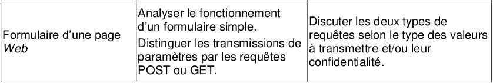
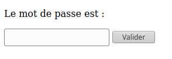
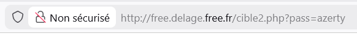
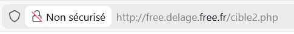
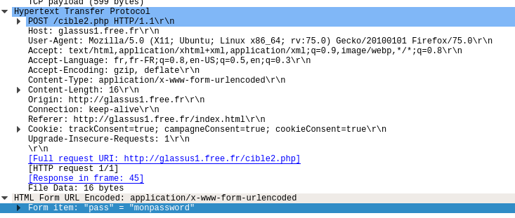
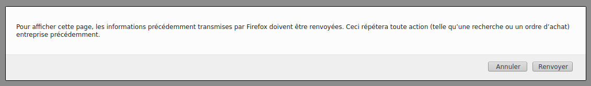
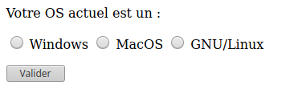
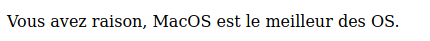

# 6.3 Requêtes GET, POST et formulaires

{: .center}

## 1. Côté client : comment envoyer des paramètres à un serveur ?

### 1.1. La méthode GET

Considérons le formulaire suivant, inclus dans une page html ouverte dans le navigateur du client :

```html 
Le mot de passe est :
<form action="cible2.php" method="get">
<p>
    <input type="password" name="pass" /> 
    <input type="submit" value="Valider" />
</p>
</form>
```

**Aperçu :**

{: .center}


**Explications :**

- le fichier ```cible2.php``` est le fichier sur le serveur qui recevra les paramètres contenus dans le formulaire.
- le paramètre sera nommé ```pass``` et sera de type ```password```, ce qui signifie qu'on n'affichera pas les caractères tapés par l'utilisateur.
On aurait pu aussi avoir un type :
    - ```text``` : le texte s'affiche en clair (pour les login par ex) 
    - ```radio``` : pour une sélection (d'un seul élément)
    - ```checkbox``` : pour une sélection (éventuellement multiple)
- un bouton comportant le label «Valider» déclenchera l'envoi (grâce au type particulier ```submit```) des paramètres (ici un seul, la variable ```pass```) au serveur.

#### Test :
1. Rendez-vous sur la page [http://free.delage.free.fr/ex_get.html](http://free.delage.free.fr/ex_get.html){:target="_blank"} et testez un mot de passe.
2. Observez attentivement l'url de la page sur laquelle vous êtes arrivés. Que remarquez-vous ?


#### La méthode GET et la confidentialité :
Les paramètres passés au serveur par la méthode GET sont transmis **dans l'url de la requête**. Ils sont donc lisibles **en clair** par n'importe qui.

{: .center}

Évidemment, c'est une méthode catastrophique pour la transmission des mots de passe. Par contre, c'est une méthode efficace pour accéder directement à une page particulière : ainsi l'url [https://www.google.fr/search?q=arpajon](https://www.google.fr/search?q=arpajon){:target="_blank"} nous amènera directement au résultat de la recherche Google sur le mot-clé «arpajon».


### 1.2. La méthode POST

Dans notre code de formulaire du 1.1, modifions l'attribut ```method```, auparavant égal à ```"get"```. Passons-le égal à ```"post"```  :

```html 
Le mot de passe est :
<form action="cible2.php" method="post">
<p>
    <input type="password" name="pass" /> 
    <input type="submit" value="Valider" />
</p>
</form>
```

#### Test :
1. Rendez-vous sur la page [http://free.delage.free.fr/ex_post.html](http://free.delage.free.fr/ex_post.html){:target="_blank"} et testez un mot de passe.
2. Observez attentivement l'url de la page sur laquelle vous êtes arrivés. Que remarquez-vous ?

#### La méthode POST et la confidentialité :
Les paramètres passés au serveur par la méthode POST **ne sont pas visibles** dans l'url de la requête. Ils sont contenus dans le corps de la requête, mais non affichés sur le navigateur.

{: .center}

Donc, la transmission du mot de passe est bien sécurisée par la méthode POST ? 

:warning: Pas du tout ! Si le protocole de transmission est du ```http```  et non pas du ```https```, n'importe qui interceptant le trafic peut lire le contenu de la requête et y trouver le mot de passe en clair.

**Exemple avec [Wireshark](https://www.wireshark.org/)** :

{: .center}

Le contenu de la variable ```"pass"``` est donc visible dans le contenu de la requête. 

Le passage en ```https``` chiffre le contenu de la requête et empêche donc la simple lecture du mot de passe.


#### Résumé : quand utiliser GET ou POST ?
- **GET** : la méthode GET doit être utilisée quand les paramètres à envoyer :
    - n'ont pas de caractère confidentiel. 
    - n'ont pas vocation à créer des modifications sur le serveur (ceci est plus une bonne pratique qu'une interdiction technique)
    - ne sont pas trop longs. En effet, vu qu'ils seront contenus dans l'url, il peut exister des limites de longueur spécifiques au navigateur. Une taille inférieure à 2000 caractère est conseillée.
    Si vous vous demandez à quoi peuvent servir des url si longues, songez à ce type d'url, (ici PythonTutor) où le code du programme à analyser est **contenu** dans l'url : 
    [http://pythontutor.com/visualize.html#code=L%20%3D%20%5B2,%203,%206,%207,%2011,%2014,%2018,%2019,%2024%5D%0A%0Adef%20trouve_dicho%28L,%20n%29%20%3A%0A%20%20%20%20indice_debut%20%3D%200%0A%20%20%20%20indice_fin%20%3D%20len%28L%29%20-%201%0A%20%20%20%20while%20indice_debut%20%3C%3D%20indice_fin%20%3A%0A%20%20%20%20%20%20%20%20indice_centre%20%3D%20%28indice_debut%20%2B%20indice_fin%29%20//%202%0A%20%20%20%20%20%20%20%20valeur_centrale%20%3D%20L%5Bindice_centre%5D%0A%20%20%20%20%20%20%20%20if%20valeur_centrale%20%3D%3D%20n%20%3A%0A%20%20%20%20%20%20%20%20%20%20%20%20return%20indice_centre%0A%20%20%20%20%20%20%20%20if%20valeur_centrale%20%3C%20n%20%3A%0A%20%20%20%20%20%20%20%20%20%20%20%20indice_debut%20%3D%20indice_centre%20%2B%201%0A%20%20%20%20%20%20%20%20else%20%3A%0A%20%20%20%20%20%20%20%20%20%20%20%20indice_fin%20%3D%20indice_centre%20-%201%0A%20%20%20%20return%20None%0A%0Aprint%28trouve_dicho%28L,14%29%29&cumulative=false&curInstr=0&heapPrimitives=nevernest&mode=display&origin=opt-frontend.js&py=3&rawInputLstJSON=%5B%5D&textReferences=false](http://pythontutor.com/visualize.html#code=L%20%3D%20%5B2,%203,%206,%207,%2011,%2014,%2018,%2019,%2024%5D%0A%0Adef%20trouve_dicho%28L,%20n%29%20%3A%0A%20%20%20%20indice_debut%20%3D%200%0A%20%20%20%20indice_fin%20%3D%20len%28L%29%20-%201%0A%20%20%20%20while%20indice_debut%20%3C%3D%20indice_fin%20%3A%0A%20%20%20%20%20%20%20%20indice_centre%20%3D%20%28indice_debut%20%2B%20indice_fin%29%20//%202%0A%20%20%20%20%20%20%20%20valeur_centrale%20%3D%20L%5Bindice_centre%5D%0A%20%20%20%20%20%20%20%20if%20valeur_centrale%20%3D%3D%20n%20%3A%0A%20%20%20%20%20%20%20%20%20%20%20%20return%20indice_centre%0A%20%20%20%20%20%20%20%20if%20valeur_centrale%20%3C%20n%20%3A%0A%20%20%20%20%20%20%20%20%20%20%20%20indice_debut%20%3D%20indice_centre%20%2B%201%0A%20%20%20%20%20%20%20%20else%20%3A%0A%20%20%20%20%20%20%20%20%20%20%20%20indice_fin%20%3D%20indice_centre%20-%201%0A%20%20%20%20return%20None%0A%0Aprint%28trouve_dicho%28L,14%29%29&cumulative=false&curInstr=0&heapPrimitives=nevernest&mode=display&origin=opt-frontend.js&py=3&rawInputLstJSON=%5B%5D&textReferences=false){:target="_blank"}
    <br>
- **POST** : la méthode POST doit être utilisée quand les paramètres à envoyer :
    - ont un caractère confidentiel (attention, à coupler impérativement avec un protocole de chiffrement).
    - peuvent avoir une longueur très importante (le paramètre étant dans le corps de la requête et non plus dans l'url, sa longueur peut être arbitraire).
    - ont vocation à provoquer des changements sur le serveur. Ainsi, un ordre d'achat sur un site de commerce sera nécessairement passé par une méthode POST. Les navigateurs préviennent alors le risque de «double commande» lors d'une actualisation malencontreuse de la page par l'utilisateur par la fenêtre :

    {: .center}

    Cette fenêtre est caractéristique de l'utilisation d'une méthode POST.

## 2. Côté serveur : comment récupérer les paramètres envoyés ?

Du côté du serveur, le langage utilisé (PHP, Java...) doit récupérer les paramètres envoyés pour modifier les élements d'une nouvelle page, mettre à jour une base de données, etc. Comment sont récupérées ces valeurs ? 

#### Exemple en PHP

 L'acronyme **PHP** signifie **P**HP : **H**ypertext **P**rocessor (c'est un [acronyme récursif](https://fr.wikipedia.org/wiki/Sigles_auto-r%C3%A9f%C3%A9rentiels){:target="_blank"}).

 Notre exemple va contenir deux fichiers :

 - une page ```page1.html``` , qui contiendra un formulaire et qui renverra, par la méthode GET, un paramètre à la page ```page2.php```.
 - une page ```page2.php``` , qui génèrera un code ```html ``` personnalisé en fonction du paramètre reçu.  

#### ```page1.html``` 

```html
<!DOCTYPE html>
<html>
  <head>
    <meta charset="utf-8">
    <title>exemple</title>
  </head>
  <body>
 Votre OS actuel est un : 
<form action=page2.php method="get">
<p>
    <input type="radio" name="OS" value="Windows"> Windows </input>
    <input type="radio" name="OS" value="MacOS"> MacOS </input>
    <input type="radio" name="OS" value="GNU/Linux"> GNU/Linux </input>
</p>
<p> 
    <input type="submit" value="Valider" />
</p>
</form>
  </body>
</html>
``` 

#### ```page2.php``` 
```php
 <!DOCTYPE html>
<html>
    <head>
        <meta charset="utf-8" />
        <title>Le meilleur OS</title>
    </head>
    <body>
 <p>
	<?php
  if (isset($_GET['OS']))
  {
	Print("Vous avez raison, ");
  echo $_GET['OS'];
  Print(" est le meilleur des OS.");
  }
	?>
	</p>

</body>
</html>
```

#### Détail du fonctionnement :
 1. À l'arrivée sur la page ```page1.html```, un formulaire de type boutons radio lui propose :
 {: .center}
 2. Lorsque l'utilisateur clique sur «Valider», la variable nommée ```OS``` va recevoir la valeur choisie et va être transmise par une requête GET à l'url donnée par la variable ```action``` définie en début de formulaire.
 Ici, le navigateur va donc demander à accéder à la page ```page2.php?OS=MacOS``` (par exemple)
 3. Le serveur PHP qui héberge la page ```page2.php``` va recevoir la demande d'accès à la page ainsi que la valeur de la variable ```OS```.
 Dans le code PHP, on reconnait :
     - le booléen ```isset($_GET['OS'])```  qui vérifie si le paramètre ```OS``` a bien reçu une valeur.
     - l'expression ```$_GET['OS']``` qui récupère cette valeur. 
     Si la valeur avait été transmise par méthode POST (pour un mot de passe, par exemple), la variable aurait été récupérée par ```$_POST['OS']```. Elle n'aurait par contre pas été affichée dans l'url de la page.
4. La page ```page2.php?OS=MacOS``` s'affiche sur le navigateur de l'utilisateur :

{: .center}

#### Remarque
L'exemple ci-dessus est un mauvais exemple : rien ne justifie l'emploi d'un serveur distant. L'affichage de ce message aurait très bien pu se faire en local sur le navigateur du client, en Javascript par exemple.

L'envoi de paramètre à un serveur distant est nécessaire pour aller interroger une base de données, par exemple (lorsque vous remplissez un formulaire sur le site de la SNCF, les bases de données des horaires de trains, des places disponibles et de leurs tarifs ne sont pas hébergées sur votre ordinateur en local...).

La vérification d'un mot de passe doit aussi se faire sur un serveur distant.

## TP - Attaque par dictionnaire
## Audit de sécurité d’un système d’authentification

{: .center width=40%}

### Objectifs

Dans cette activité, vous allez :

* comprendre comment un formulaire web transmet des données ;
* utiliser Python pour interagir avec une page web ;
* réaliser une **attaque par dictionnaire** ;
* analyser les faiblesses d’un système d’authentification ;
* proposer des solutions pour améliorer sa sécurité.

!!! warning "Cadre légal et éthique"

    Cette activité est réalisée **uniquement dans un cadre pédagogique**, sur une page volontairement vulnérable mise à disposition pour l’exercice.

    Toute tentative similaire sur un site réel sans autorisation explicite constitue une pratique 

### Contexte

Vous êtes chargé d’auditer un prototype de page de connexion développé pour une petite entreprise.

Le développeur affirme que son système est sécurisé.

Votre mission est de vérifier cette affirmation.

La page à analyser est :

[http://free.delage.free.fr/exo_BF.html](http://free.delage.free.fr/exo_BF.html){. target="_blank"}


### Quelques rappels

Il existe plusieurs façons de retrouver un mot de passe.

### Force brute

Tester **toutes les combinaisons possibles**

Exemple :

```text
aaaa
aaab
aaac
...
```

### Attaque par dictionnaire

Tester une liste de mots de passe fréquemment utilisés.

Exemple :

```text
password
azerty
birthday
123456
```

Dans cette activité, vous allez réaliser une **attaque par dictionnaire**.

### Le dictionnaire RockYou

Nous allons nous appuyer sur une fuite célèbre : le leak de **RockYou**.

En 2009, le site RockYou a été piraté, révélant plus de 32 millions de mots de passe stockés en clair.

Cette fuite a montré deux problèmes majeurs :

* de nombreux utilisateurs choisissent des mots de passe faibles ;
* les mots de passe ne doivent jamais être stockés en clair.

Nous utiliserons une version réduite contenant les **1000 mots de passe les plus fréquents** :

`extraitrockyou.txt`

## 1. Préparation de l’environnement

!!! tip "Important"

    Cette activité n’est pas réalisable sous Capytale, car le module `requests` n’y est pas disponible.

    Utilisez par exemple :

    - Thonny
    - VS Code
    - PyCharm

Les réponses devront être déposées sur ce [notebook Capytale](https://capytale2.ac-paris.fr/web/c/eac1-10947611){. target="_blank"}.

### 1.1 Téléchargement

Téléchargez (clic droit : Enregister sous):

[extraitrockyou.txt](data/extraitrockyou.txt){. target="_blank"}

Placez-le dans le même dossier que votre futur script Python.

### 1.2 Lecture du fichier

Créez un fichier :

`audit.py`

Ajoutez :

```python
liste_mdp = open("extraitrockyou.txt").read().splitlines()
```

Cette instruction crée une liste contenant 1000 mots de passe.

### Question 1

Écrire un programme qui :

* affiche les **10 premiers mots de passe**
* affiche le nombre total de mots de passe

## 2. Observer le fonctionnement du site

Rendez-vous sur :

[http://free.delage.free.fr/exo_BF.html](http://free.delage.free.fr/exo_BF.html){. target="_blank"}


### Question 2

Inspectez le code source de la page (Touche F12 du clavier). 

Répondez :

1. Quelle page traite le formulaire ?
2. Quelle méthode HTTP est utilisée ?
3. Quel est le nom du paramètre envoyé ?
4. Pourquoi cette méthode n’est-elle pas adaptée pour transmettre un mot de passe ?

## 3. Utilisation du module requests

Le module `requests` permet d’interroger une page web.

Le module `requests` n’est généralement **pas inclus** dans l’installation standard de Python.

Si tu écris :

```python
import requests
```

tu risques d’avoir une erreur du style :

```text
ModuleNotFoundError: No module named 'requests'
```

Pour l’installer :   
*solution 1 :* dans le terminal de Thonny (Outils/Ouvrir la console du sytème...) tapez et exécutez:

```bash
python -m pip install requests
```
*solution 2 :*  A l'aide du gestionnaire de paquets (Outils/Gérer les paquets...)  

Ensuite vérifie :

```python
import requests

r = requests.get("https://httpbin.org/get")
print(r.status_code)
```

Si ça affiche `200`, c’est bon.

Exécutez :

```python
import requests

p = requests.get("http://free.delage.free.fr/interesting.html")

print(p.text)
```

### Question 3

Que représente :

* `p.url`
* `p.status_code`
* `p.text`

### Question 4

Exécutez :

```python
import requests

p = requests.get("http://free.delage.free.fr/exo_BF.html")

print(p.text)
```

Que contient la réponse ?

## 4. Proposer un mot de passe

### Test manuel

Dans votre navigateur, sur la page web, entrez le mot de passe :

`michelet`

### Question 5

Quelle URL apparaît dans la barre d’adresse ?

Expliquez comment le mot de passe est transmis au serveur.

### Test automatisé

Écrire un programme qui propose le mot de passe :

`vacances`

et affiche la réponse obtenue.

## 5. Génération automatique des tentatives

### Rappel : concaténation

```python
base = "bonjour "
nom = "Alice"

phrase = base + nom
```

### Question 6

Écrire un programme qui affiche les **10 premières URLs de test** construites à partir de `liste_mdp`.

Exemple attendu :

```text
http://free.delage.free.fr/rep_BF.php?pass=123456
http://free.delage.free.fr/rep_BF.php?pass=12345
...
```

## 6. Recherche automatisée du mot de passe

Votre objectif :

tester automatiquement les mots de passe du dictionnaire.

Le programme devra :

1. parcourir la liste ;
2. envoyer chaque tentative ;
3. analyser la réponse ;
4. s’arrêter dès que le mot de passe est trouvé.

### Question 7

Écrire le programme complet.

Afficher :

```text
Mot de passe trouvé : ...
```

## 7. Analyse de sécurité

Vous venez de compromettre ce système.

Il est donc vulnérable.


### Question 8

Expliquez **pourquoi** cette attaque a fonctionné.


### Question 9

Citez au moins **3 mesures** qui auraient permis de rendre cette attaque plus difficile.


## 8. Réflexion finale

### Question 10

Pourquoi est-il dangereux d’utiliser un mot de passe présent dans une fuite publique comme RockYou ?

## Pour aller plus loin

Modifier votre programme pour :

### Question 11

Compter le nombre de tentatives nécessaires.

### Question 12

Mesurer le temps d’exécution.  
voir [Time Module](https://www.w3schools.com/python/ref_module_time.asp){. target="_blank"}


## Ce qu’il faut retenir

Un système d’authentification sécurisé doit :

* utiliser des mots de passe robustes ;
* limiter le nombre de tentatives ;
* utiliser POST plutôt que GET ;
* stocker les mots de passe hachés ;
* éventuellement ajouter une authentification à plusieurs facteurs.

## Comment sécuriser un système d’authentification ?

### Question 13

Expliquez brièvement les 5 mesures précédentes.


